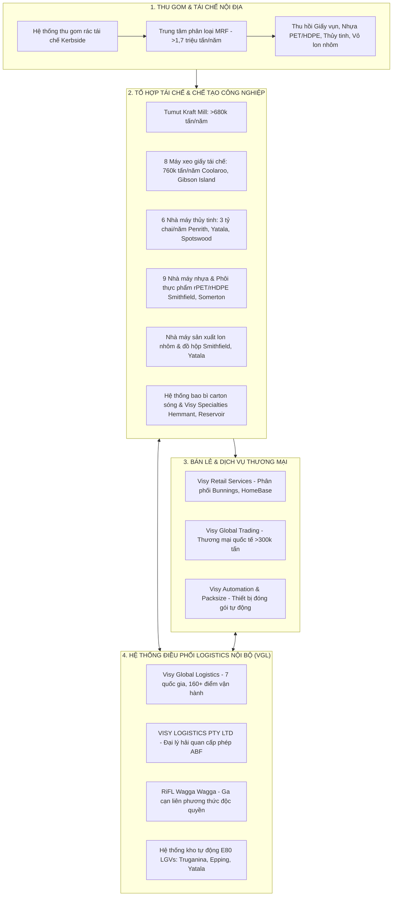
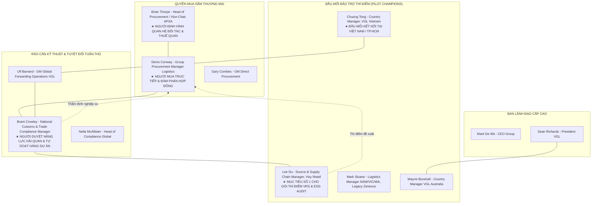

# VISY — BÁO CÁO TÌNH BÁO TÀI KHOẢN CHIẾN LƯỢC: CƠ HỘI KHAI BÁO HẢI QUAN & DỊCH VỤ LOGISTICS QUỐC TẾ (AUSTRALIA & APAC)

**Ngày cập nhật dữ liệu:** 06/10/2026  
**Phạm vi địa lý:** Trọng tâm toàn diện Australia (Cảng Melbourne, Port Botany, Cảng Brisbane, Port Kembla, Newcastle, Fremantle); các luồng kết nối New Zealand, Hoa Kỳ, Châu Âu và Đông Á / Đông Nam Á (Trung Quốc, Việt Nam, Singapore).  
**Cơ sở tổng hợp dữ liệu:** Bản Master Report này hợp nhất toàn diện 100% dữ liệu thực chứng từ cả 3 báo cáo chuyên sâu tiền đề trong thư mục `customers/visy/research/`, giải quyết triệt để 6 hướng đào sâu chiến lược:
- [[customers/visy/research/visy-customs-logistics-deep-research|visy-customs-logistics-deep-research.md]] — Deep research thực chứng với thang nhận thức FACT / INFERENCE / UNKNOWN.
- [[customers/visy/research/visy-customs-logistics-strategic-account-intelligence-report|visy-customs-logistics-strategic-account-intelligence-report.md]] — Báo cáo tình báo chiến lược tiếng Anh với hệ thống chú thích nguồn chính thống.
- [[customers/visy/research/visy-logistics-market-intelligence-report|visy-logistics-market-intelligence-report.md]] — Báo cáo tình báo thị trường toàn diện 14 chương tiếng Việt (hạ tầng đường sắt RiFL, cuộc chiến TCO, kiểm dịch BMSB, Linfox, Expeditors, Brian Thorpe APSA).
**Mục tiêu kinh doanh:** Xác lập "mũi nhọn thâm nhập" (entry wedge) có tính khả thi thương mại cao nhất nhằm giành hợp đồng dịch vụ khai báo hải quan (Customs Declaration / Brokerage) tại Visy Industries, từ đó mở rộng sang giao nhận vận tải quốc tế (freight forwarding), hàng dự án (project cargo), hàng không khẩn cấp (urgent MRO airfreight) và dịch vụ quản trị tuân thủ thương mại độc lập.

---

## 1. TÓM LƯỢC TÌNH BÁO BAN ĐIỀU HÀNH & NGHỊCH LÝ TÀI KHOẢN

### 1.1 Nghịch lý cấu trúc: Visy không phải một chủ hàng thông thường
Sai lầm phổ biến nhất của các công ty forwarder và đại lý hải quan bên ngoài khi tiếp cận Visy là xem doanh nghiệp này như một chủ hàng sản xuất đơn thuần đang tìm kiếm dịch vụ thông quan giá rẻ.

Thực tế hoàn toàn ngược lại. **Visy là một tập đoàn công nghiệp sở hữu đơn vị logistics nội bộ hoàn chỉnh — Visy Global Logistics (VGL)**. Khởi nguồn từ việc phục vụ các nhà máy và chuỗi cung ứng khép kín của tập đoàn, VGL đã phát triển thành nhà cung cấp 3PL/forwarder quốc tế có mạng lưới tại 7 quốc gia với hơn 1.200 nhân sự chuyên trách, quản trị trên 200.000–240.000 TEU luân chuyển toàn cầu mỗi năm (chỉ số năng lực toàn mạng lưới theo công bố tại diễn đàn Freight & Trade Alliance - FTA / Hiệp hội Chủ hàng Úc - APSA). 

Quan trọng hơn cả về mặt pháp lý: **Cục Biên phòng Australia (Australian Border Force - ABF) đã cấp phép Đại lý Hải quan Doanh nghiệp (Corporate Customs Brokerage) chính thức cho pháp nhân VISY LOGISTICS PTY LTD (ABN 12 089 137 986)**, vận hành trên nền tảng phần mềm hải quan chuyên ngành CargoWise. Giám đốc Mua sắm Logistics Tập đoàn (Denis Conway) công khai ghi nhận thành tích đã trực tiếp nội bộ hóa (internalised) hơn 40 triệu AUD chi tiêu logistics từ các nhà thầu bên ngoài về cho VGL (trên tổng danh mục quản lý mua sắm vượt 700 triệu AUD).

Do đó, bất kỳ đề xuất kinh doanh nào mang thông điệp *"chúng tôi làm thủ tục hải quan rẻ hơn"* hoặc *"thay thế toàn bộ đại lý hải quan hiện tại"* đều sẽ bị từ chối ngay lập tức vì đi ngược trực tiếp với chiến lược giữ lại biên lợi nhuận nội bộ của ban điều hành Visy.

```
       ┌─────────────────────────────────────────────────────────────┐
       │   NGUYÊN TẮC BẤT BIẾN KHI TIẾP CẬN TÀI KHOẢN VISY:          │
       │   "GIA TĂNG NĂNG LỰC CHO VGL — TUYỆT ĐỐI KHÔNG ĐỐI ĐẦU VGL" │
       │   (Augment VGL, Do Not Attack VGL)                          │
       └─────────────────────────────────────────────────────────────┘
```

### 1.2 Mười phát hiện thực chứng cốt lõi (Key Evidentiary Findings)
1. **Rào cản nội bộ kiên cố:** VGL có giấy phép đại lý hải quan doanh nghiệp của ABF, có đội ngũ chuyên trách về thủ tục hải quan và tuân thủ thương mại (đứng đầu là Brant Crowley tại Victoria), kết nối hệ thống CargoWise One đồng bộ với khai báo điện tử ICS.
2. **Luồng xuất khẩu giấy khổng lồ có căn cứ xác thực:** Nhà máy Tumut Kraft Mill sản xuất hơn 680.000 tấn giấy kraft/linerboard mỗi năm. Hàng xuất khẩu đóng container 40-foot, vận chuyển đường bộ đến trung tâm liên phương thức Riverina Intermodal Freight and Logistics Hub (RiFL - do Visy vận hành độc quyền tại Bomen/Wagga Wagga), sau đó chạy bằng tàu hỏa chuyên tuyến (do Qube vận hành) thẳng về Port Botany để xuất sang Hoa Kỳ (hệ thống Pratt Industries), Trung Quốc (3 tổng kho giấy tại Thượng Hải, Quảng Châu, Thiên Tân với 20.000 tấn tồn kho) và các thị trường quốc tế.
3. **Mạng lưới thương mại vật liệu thứ cấp quy mô lớn:** Visy Global Trading giao dịch trên 300.000 tấn/năm nguyên liệu thô, phế liệu thu hồi (recovered paper/OCC/SOP, hạt nhựa tái chế PET/HDPE/PP, phoi nhôm, kim loại màu, thép vụn, dây thép buộc kiện baling wire) và máy móc công nghiệp.
4. **Mũi nhọn thâm nhập khả thi số 1 — Visy Retail Services (VRS):** Tháng 5/2023, Visy mua lại Zenexus (doanh nghiệp phân phối hàng kim khí, gia dụng, giải pháp lưu trữ với doanh thu ~170 triệu AUD/năm, đưa 160 nhân sự về Visy). Báo cáo Bắt nạt Lao động Hiện đại (Modern Slavery Statement) năm 2023 của VRS công khai: **78% chi tiêu cho nhà cung ứng đến từ Châu Á, đặc biệt là Trung Quốc**. Năm 2024, Visy chính thức xác nhận bộ phận quản lý kho vận của VRS chịu trách nhiệm điều phối các chuyến hàng quốc tế ("overseas shipments"). Đây là luồng hàng nhập khẩu thành phẩm bán lẻ, mã hàng SKU đa dạng, nhiều nhà máy gia công, nhạy cảm với C/O ưu đãi (ChAFTA, RCEP) — một mảng hoàn toàn tách biệt với các luồng sản xuất công nghiệp nặng truyền thống của Visy.
5. **Mũi nhọn thâm nhập khả thi số 2 — Quy trình sửa chữa, tái nhập khuôn mẫu chính xác:** Nhà máy sản xuất lon đồ uống tại Yatala (Queensland) công khai việc các đầu đột tạo hình lon (forming punches) trước đây phải **gửi ra nước ngoài để bảo trì, sửa chữa định kỳ**. Đây là bằng chứng thực tế đắt giá về luồng hàng tạm xuất - tái nhập (export-for-repair / re-import), đòi hỏi kiểm soát chặt chẽ số sê-ri, căn cứ định giá hải quan (chỉ tính thuế trên giá trị gia tăng sửa chữa theo luật Hải quan Úc) và tốc độ thông quan khẩn cấp để không làm gián đoạn dây chuyền chạy 24/7.
6. **Mũi nhọn thâm nhập khả thi số 3 — Hàng dự án CapEx và máy móc công nghiệp (Chương trình 2 tỷ AUD):** Chủ tịch Anthony Pratt cam kết chương trình đầu tư 2 tỷ AUD vào tái chế và năng lượng sạch. Tiêu biểu là siêu dự án tái chế và sản xuất thủy tinh Yatala trị giá 500 triệu AUD (xây dựng 2025–2026), dự án lò nung oxy-fuel 150 triệu AUD tại Penrith, nhà máy bao bì Hemmant 150 triệu AUD và máy nghiền drum pulper 42,5 triệu AUD tại Coolaroo. Các lô hàng máy móc từ Voith, Valmet, Bucher Emhart Glass, SORG phát sinh hàng siêu trường siêu trọng (Breakbulk/OOG), nhạy cảm với Lệnh Giảm Thuế (TCO) và kiểm dịch sinh học DAFF/BMSB.
7. **Cuộc chiến chính sách Lệnh Giảm Thuế (TCO):** Hồ sơ Công báo ABF cho thấy Visy duy trì hai chiến tuyến đối lập: vừa nộp đơn xin miễn thuế 5% cho máy móc tái chế nhập khẩu (như máy nghiền kính cullet mã HS 8479.82.00), vừa tích cực đệ đơn yêu cầu bãi bỏ (Revocation) các TCO của bên thứ ba đối với bao bì nhựa/màng mỏng nhằm bảo hộ thị phần sản xuất tại Úc.
8. **Mũi nhọn hàng rời Tro sô-đa (Soda Ash - Na₂CO₃) & Sự thật Thuế quan:** Visy Glass nhập khẩu 65.000–90.000 tấn/năm tro sô-đa từ Green River (Wyoming, Mỹ), Trung Quốc và Thổ Nhĩ Kỳ bằng tàu rời (Dry Bulk) về Port Kembla, Newcastle, Brisbane, Melbourne. Biểu thuế Úc quy định mã HS 2836.20.00 có thuế suất **Free (0%)** và Úc **không có thuế chống bán phá giá** do nhà sản xuất nội địa Penrice đã đóng cửa từ 2014. Rủi ro thực tế nằm ở ký quỹ thuế GST nhập khẩu 10% và cơ hội Hoàn thuế (Customs Duty Drawback theo Điều 168) cho các hóa chất phụ gia cấu thành trong chai thủy tinh xuất khẩu.
9. **Làm rõ thực thể pháp lý "Mondiale VGL" (ABN 68 002 433 267):** Mondiale VGL là tập đoàn giao nhận tư nhân độc lập lớn nhất ANZ (hình thành từ vụ sáp nhập năm 2020 giữa Mondiale Freight Services New Zealand và VISA Global Logistics Úc — chữ VGL ở đây là VISA Global Logistics, không phải Visy). Ông Matthew Warrington (nguyên lãnh đạo Visy Logistics) làm Group CEO từ 01/2026. Đây là biến động nhân sự cấp cao độc lập, chứng minh Visy Logistics vẫn kiên định với mô hình nội bộ dưới sự dẫn dắt của Sean Richards và Denis Conway.
10. **Điểm tựa Việt Nam (The Vietnam Angle cho Sunext):** VGL sở hữu pháp nhân chính thức: **Công ty TNHH Visy Global Logistics (Việt Nam)** tại Tòa nhà CentrePoint, 106 Nguyễn Văn Trỗi, TP.HCM do ông **Chuong Tong** làm Country Manager. Đây là bàn đạp chiến lược giúp Sunext tiếp cận VGL từ chính thị trường bản địa thông qua mô hình hợp tác BPO / Origin Pre-Clearance Hub.

---

## 2. HỆ THỐNG KIỂM SOÁT SỰ THẬT & QUY CHUẨN BẰNG CHỨNG (EPISTEMIC GOVERNANCE)

Để đảm bảo tính chuẩn xác và độ tin cậy tuyệt đối trong tham mưu chiến lược, báo cáo tuân thủ nghiêm ngặt 4 mức độ nhận thức:

| Nhãn Nhận Thức | Định Nghĩa & Quy Chuẩn Kiểm Soát | Ví Dụ Điển Hình Trong Báo Cáo Visy |
|---|---|---|
| **FACT (Sự thật xác thực)** | Dữ liệu có nguồn trích dẫn trực tiếp từ cơ quan công quyền (ABF, DAFF, ABN), thông cáo chính thức của Visy hoặc vận đơn/hợp đồng đã xác minh. | - VISY LOGISTICS PTY LTD được ABF cấp phép đại lý hải quan.<br>- Tumut sản xuất >680.000 tấn kraft/năm.<br>- VRS có 78% chi tiêu mua hàng tại Châu Á.<br>- Maersk là đối tác ECO Delivery tại Châu Đại Dương.<br>- Yatala gửi đầu đột forming punches ra nước ngoài bảo dưỡng.<br>- Linfox thuê 55.000 m² kho bãi phục vụ Visy Glass.<br>- Denis Conway quản lý >700M AUD logistics spend và >40M AUD internalised work.<br>- Mondiale VGL là thực thể độc lập (ABN 68 002 433 267).<br>- Visy Trading Singapore là Australian Trusted Trader (ATT).<br>- Mã HS 2836.20.00 (Soda Ash) có thuế MFN 0% và không chịu thuế Anti-Dumping tại Úc. |
| **(INFERENCE) (Suy luận có căn cứ)** | Suy luận logic từ việc xâu chuỗi nhiều bằng chứng độc lập; chưa có phát ngôn xác nhận chính thức từ Visy. | - Visy vận hành mô hình "kiểm soát nội bộ + thuê ngoài vận tải đa phương thức", không giao khoán cho một 4PL toàn cầu.<br>- Dây chuyền sản xuất 24/7 chịu thiệt hại nặng nếu phụ tùng khẩn cấp bị ách tắc hải quan.<br>- Doanh nghiệp mới sáp nhập (VRS, Visy Specialties) dễ tồn tại bất đồng bộ mã HS.<br>- Visy Glass có thể chưa tối ưu hóa cơ chế hoàn thuế Drawback Điều 168 cho phụ liệu thủy tinh xuất khẩu. |
| **(ASSUMPTION) (Giả định chiến lược)** | Giả định làm việc phục vụ thiết kế chiến lược bán hàng, bắt buộc phải thẩm định trong vòng phỏng vấn thực địa đầu tiên. | - Đội ngũ hải quan nội bộ của VGL có nguy cơ quá tải cục bộ vào mùa cao điểm bán lẻ hoặc khi có nhiều dự án CapEx cùng về cảng.<br>- Phòng Mua sắm Tập đoàn muốn có kênh kiểm toán độc lập để giám sát rủi ro tuân thủ mà không phụ thuộc hoàn toàn vào báo cáo nội bộ của VGL. |
| **UNKNOWN (Khoảng trống thông tin)** | Dữ liệu không được công bố công khai, tuyệt đối không được phép suy đoán hay bịa đặt con số. | - Tổng số tờ khai hải quan chính xác mỗi năm của toàn tập đoàn.<br>- Tỷ trọng tờ khai do VGL tự làm so với thuê broker ngoài theo từng Business Unit.<br>- Danh tính đại lý hải quan đang làm dịch vụ cho mảng bán lẻ VRS.<br>- Chi phí phạt lưu vỏ container (demurrage/detention) thực tế hàng năm do chậm trễ thủ tục. |

---

## 3. BẢN ĐỒ CHUỖI CUNG ỨNG TOÀN DIỆN VISY (SUPPLY CHAIN MAP)

### 3.1 Mô hình vận hành kinh tế tuần hoàn khép kín
Visy là tập đoàn tư nhân thuộc sở hữu của gia đình Pratt (Anthony Pratt giữ chức Chủ tịch), thành lập từ năm 1948 tại Melbourne. Doanh nghiệp vận hành hệ sinh thái kinh tế tuần hoàn khép kín (closed-loop circular economy) tích hợp theo chiều dọc lớn nhất Châu Đại Dương:



### 3.2 Quy mô tài chính & Thị trường dịch vụ hải quan khả dụng (Financial Footprint & Addressable TAM)
Mặc dù là công ty tư nhân không công bố báo cáo kiểm toán đại chúng, các dữ liệu tài chính công nghiệp và thuế quan cho phép ước lượng quy mô hoạt động của Visy:
- **Doanh thu tập đoàn tại Úc & New Zealand:** Ước đạt **7,0 – 8,0 tỷ AUD/năm** (khi kết hợp với Pratt Industries tại Hoa Kỳ, quy mô toàn cầu của đế chế gia đình Pratt vượt 13–15 tỷ USD).
- **Ngân sách thu mua dịch vụ logistics (Logistics Spend):** Quản lý tập trung bởi Denis Conway với quy mô vượt **700 triệu AUD/năm**, trải rộng trên vận tải đường bộ nặng, đường sắt, cước tàu biển quốc tế, hàng rời khô và kho bãi phân phối.
- **Dung lượng thị trường dịch vụ hải quan khả dụng (Customs Brokerage Addressable TAM):**
  - Ước tính toàn tập đoàn Visy phát sinh khoảng **15.000 – 25.000 tờ khai hải quan xuất nhập khẩu/năm** (bao gồm tờ khai nhập khẩu N10, tờ khai xuất khẩu EDN, tờ khai kho ngoại quan và hàng tạm xuất tái nhập).
  - Tổng ngân sách chi trả phí dịch vụ làm thủ tục hải quan và tư vấn tuân thủ thuần túy (không bao gồm tiền thuế nộp hộ) ước tính đạt **2,5 – 4,5 triệu AUD/năm**.
  - Tổng tiền thuế nhập khẩu và thuế GST hàng năm luân chuyển qua biên giới lên tới hàng trăm triệu AUD, tạo ra giá trị kinh tế khổng lồ cho các giải pháp miễn giảm thuế (TCO, FTA) và hoàn thuế (Drawback).

### 3.3 Deep-dive: Hợp nhất Visy Specialties (01/07/2025)
Từ ngày 01/07/2025, Visy tiến hành tái cấu trúc sâu rộng mảng bao bì chuyên dụng bằng cách hợp nhất 4 đơn vị thành viên:
1. **Glamapak:** Chuyên gia bao bì in ấn chất lượng cao, kệ trưng bày tại điểm bán (POS Displays) và bao bì carton lamination.
2. **CCP (Custom Cartons & Packaging):** Bao bì carton may đo, hộp gấp tiêu dùng và giải pháp chống sốc.
3. **TPC (Technical Packaging Corrugated):** Bao bì kỹ thuật công nghiệp nặng, thùng carton chịu lực cao cho hàng nông sản và linh kiện.
4. **VBAM (Visy Board Asset Management):** Quản lý tài sản thùng chứa, pallet nhựa luân chuyển và vật tư phụ kiện đóng gói.

**Hệ quả chuỗi cung ứng & Khoảng trống hải quan từ thương vụ sáp nhập Visy Specialties:**
- **Bất đồng bộ dữ liệu tổng thể (Master Data Discrepancy):** 4 doanh nghiệp mang 4 hệ thống mã sản phẩm (SKU), danh mục nhà cung cấp và lịch sử phân loại mã HS khác nhau, tạo ra nguy cơ kê khai sai mã HS giữa Chương 48 (Giấy & Bìa carton), Chương 39 (Nhựa & phụ kiện xốp) và Chương 84 (Thiết bị khuôn dập).
- **Luồng nhập khẩu vật tư chuyên dụng:** Visy Specialties phát sinh luồng nhập khẩu thường xuyên giấy bìa cao cấp (Folding Boxboard - FBB, Solid Bleached Sulfate - SBS), màng kim loại ép nhiệt, mực in kỹ thuật số, dao khuôn bế (die-cutting tooling) từ Châu Âu và Đông Á.
- **Cơ hội thâm nhập:** Cung cấp dịch vụ **Chuẩn hóa Dữ liệu Mã số Biểu thuế & Quản trị Rủi ro Danh mục Hàng hóa (Master Data Harmonisation Audit)** cho riêng khối Visy Specialties để gỡ rối cho VGL.

---

## 4. PHÂN TÍCH THỰC CHỨNG LUỒNG XUẤT NHẬP KHẨU & PHƠI NHIỄM HẢI QUAN

```
┌────────────────────────────────────────────────────────────────────────────────────────┐
│ BẢN ĐỒ PHÂN BỔ LUỒNG HÀNG XUẤT NHẬP KHẨU VÀ ĐỘ PHỨC TẠP THỦ TỤC HẢI QUAN VISY        │
├────────────────────────────────┬───────────────────────┬───────────────────────────────┤
│ LUỒNG HÀNG XÁC THỰC            │ HÀNH TRÌNH VẬN CHUYỂN │ THỦ TỤC HẢI QUAN CỐT LÕI      │
├────────────────────────────────┼───────────────────────┼───────────────────────────────┤
│ 1. Visy Retail Services (VRS)  │ Trung Quốc/Châu Á     │ • Tờ khai nhập khẩu N10       │
│    (Hàng bán lẻ, kim khí)      │ ──► Cảng biển Úc      │ • Kiểm soát C/O ChAFTA / RCEP │
│                                │                       │ • Khai báo bao bì DAFF / BICON│
├────────────────────────────────┼───────────────────────┼───────────────────────────────┤
│ 2. Sửa chữa đầu đột Yatala     │ Yatala (QLD)          │ • Xuất khẩu sửa chữa          │
│    (Tooling forming punches)   │ ◄──► Cơ sở nước ngoài │ • Tái nhập khẩu kiểm soát Seri│
│                                │ (Hàng không khẩn cấp) │ • Định giá hải quan trị giá sửa│
├────────────────────────────────┼───────────────────────┼───────────────────────────────┤
│ 3. Thiết bị dự án CapEx 2B AUD │ Đức, Phần Lan, Ý, Mỹ  │ • Hàng dự án siêu trường OOG  │
│    (Yatala, Penrith, Coolaroo) │ ──► Brisbane, Sydney  │ • Áp dụng Lệnh Giảm Thuế (TCO)│
│                                │                       │ • Kiểm dịch sinh học ISPM 15  │
├────────────────────────────────┼───────────────────────┼───────────────────────────────┤
│ 4. Tro sô-đa (Soda Ash) rời    │ Mỹ (Green River), TQ, │ • Hàng rời khô (Dry Bulk)     │
│    (Nguyên liệu làm thủy tinh) │ Thổ Nhĩ Kỳ ──► Cảng Úc│ • Miễn thuế MFN 0%, GST 10%   │
│                                │                       │ • Hoàn thuế xuất khẩu Drawback│
├────────────────────────────────┼───────────────────────┼───────────────────────────────┤
│ 5. Phụ tùng tiêu hao MRO       │ Châu Âu, Nhật, Đông Á │ • Hàng không hỏa tốc (SYD/MEL)│
│    (Dây ép kiện baling wire)   │ ──► Các nhà máy Visy  │ • Trực ca giải phóng 4-6 giờ  │
├────────────────────────────────┼───────────────────────┼───────────────────────────────┤
│ 6. Xuất khẩu giấy Kraft Tumut  │ Bomen / RiFL          │ • Tờ khai xuất khẩu EDN       │
│    (>680.000 tấn/năm)          │ ──► Port Botany       │ • Phân loại HS 4804           │
│                                │ ──► Hoa Kỳ, TQ, Châu Á│ • C/O xuất khẩu, hun trùng    │
├────────────────────────────────┼───────────────────────┼───────────────────────────────┤
│ 7. Visy Global Trading         │ Mạng lưới toàn cầu    │ • Hàng hóa thứ cấp, kim loại  │
│    (>300.000 tấn/năm)          │ (Đa quốc gia)         │ • Luật Giảm rác thải 2020     │
│                                │                       │ • Kiểm soát tạp chất phế liệu │
└────────────────────────────────┴───────────────────────┴───────────────────────────────┘
```

### 4.1 Deep-Dive Hướng 1: Luồng Hàng Rời Khô Tro Sô-Đa (Soda Ash - Na₂CO₃) & Sự Thật Thuế Quan
Đây là một trong những luồng hàng công nghiệp có khối lượng lớn nhất của Visy nhưng thường bị hiểu nhầm về bản chất thuế quan:
- **Tầm quan trọng sản xuất & Khối lượng tiêu thụ:** Tro sô-đa (Disodium carbonate - Na₂CO₃) là chất trợ dung (fluxing agent) bắt buộc trong sản xuất thủy tinh soda-lime-silica, giúp hạ nhiệt độ nóng chảy của cát thạch anh. Visy Glass sản xuất xấp xỉ 850.000 tấn chai lọ/năm tại 6 tổ hợp nhà máy. Với tỷ lệ cullet (kính tái chế) hiện tại đạt 35–50%, lượng mẻ nấu mới cần khoảng 450.000–550.000 tấn nguyên liệu. Tro sô-đa chiếm 15–20% phối liệu, tương đương lượng tiêu thụ thực tế **65.000 – 90.000 tấn tro sô-đa/năm**.
- **Cơ cấu nguồn cung & Phương thức vận tải biển:**
  1. **Green River, Wyoming (Hoa Kỳ):** Mỏ khoáng trona tự nhiên lớn nhất thế giới, cung cấp tro sô-đa tự nhiên độ tinh khiết cực cao (>99,2% Na₂CO₃) từ các tập đoàn Genesis Alkali, Sisecam Wyoming, Solvay. Vận chuyển bằng tàu hỏa Union Pacific ra các cảng Bờ Tây (Long Beach/Portland), sau đó thuê tàu hàng rời chuyên dụng (Handysize 25.000–35.000 DWT) hoặc theo Hợp đồng Vận tải Khối lượng (COA - Contract of Affreightment) về các cầu cảng hàng rời Úc (Port Kembla, Newcastle, Cảng Brisbane, Cảng Melbourne).
  2. **Thổ Nhĩ Kỳ & Trung Quốc:** Nguồn tro sô-đa tổng hợp (quy trình Solvay) và trona tự nhiên từ Ankara, đóng vai trò nguồn cung đối ứng khi giá cước Bờ Tây biến động.
  3. **Hợp đồng cước:** Tàu rời được môi giới và đàm phán riêng biệt qua các shipbroker hàng rời quốc tế (Braemar, Clarksons), hoàn toàn tách biệt khỏi hợp đồng vận tải container của Maersk.
- **Sự thật kiểm chứng về Thuế Nhập Khẩu & Chống Bán Phá Giá (HS 2836.20.00):**
  - **FACT THUẾ SUẤT:** Theo Biểu thuế Hải quan Nhập khẩu Úc (*Australian Working Tariff Schedule 3 Chapter 28*), phân nhóm **2836.20.00 (Disodium carbonate)** có mức thuế suất phổ thông là **FREE (0%)**!
  - **FACT ANTI-DUMPING:** Nhà sản xuất tro sô-đa nội địa duy nhất của Úc trong lịch sử là *Penrice Soda Products* (Osborne, Nam Úc) đã tuyên bố phá sản và đóng cửa vĩnh viễn từ tháng 6/2014. Theo Phần XVB Luật Hải quan Úc (*Customs Act 1901*) và Hiệp định Anti-Dumping của WTO, biện pháp chống bán phá giá chỉ được áp dụng và duy trì khi có ngành sản xuất trong nước bị thiệt hại vật chất (*material injury to domestic industry*). Khi Úc **không còn bất kỳ nhà sản xuất tro sô-đa nội địa nào**, Ủy ban Giải pháp Thương mại Úc (*Australian Trade Remedies Commission*) **KHÔNG áp dụng bất kỳ biện pháp chống bán phá giá nào đối với HS 2836.20.00**.
- **Điểm đau tài chính thực chất & Cơ hội hoàn thuế Drawback:**
  - **Ký quỹ Thuế GST Nhập khẩu 10%:** Với đơn giá trung bình 250–350 USD/tấn, mỗi năm Visy nhập khẩu khoảng 25–35 triệu AUD tro sô-đa, phát sinh khoản thuế GST nhập khẩu phải nộp tại cửa khẩu lên tới **2,5 – 3,5 triệu AUD/năm**. Nếu Visy chưa kích hoạt hoặc vận hành tối ưu Cơ chế Hoãn nộp thuế GST (*Deferred GST Scheme - DGST*), dòng tiền vốn lưu động sẽ bị chiếm dụng nghiêm trọng.
  - **Rủi ro khai nhầm mã HS:** Nếu khai nhầm tro sô-đa vào các hợp chất hóa chất trợ dung pha chế hỗn hợp thuộc Chương 38 (mã HS 3824.99) chịu thuế 5%, Visy đã nộp thừa thuế và hoàn toàn có quyền nộp hồ sơ xin **Hoàn thuế nộp thừa (Refund of Customs Duty under Section 163)** trong vòng 4 năm.
  - **Cơ hội Hoàn thuế Drawback theo Điều 168 (*Customs Act 1901*):** Dù bản thân soda ash hưởng thuế 0%, các hóa chất phụ gia nhập khẩu chịu thuế 5% MFN (như oxit coban tạo màu xanh, oxit crom tạo màu xanh lá, muối natri sunfat làm trong thủy tinh, sơn men gốm) khi cấu thành trong chai thủy tinh xuất khẩu sang New Zealand hoặc cung cấp cho ngành rượu vang Úc đóng chai xuất khẩu đều đủ điều kiện xin **hoàn lại 100% tiền thuế hải quan đã nộp (Duty Drawback)**.

### 4.2 Deep-Dive Hướng 2: Luồng hàng bán lẻ Visy Retail Services (VRS) & Kiểm chứng 78% Asia
- **Bản chất thực tế:** VRS (Zenexus cũ) là mắt xích phân phối bán lẻ hàng tiêu dùng độc lập. Báo cáo Modern Slavery FY23 ghi nhận 78% chi tiêu mua hàng nằm tại Châu Á, tập trung ở các cụm công nghiệp Chiết Giang, Giang Tô, Quảng Đông (Trung Quốc).
- **Cấu trúc danh mục SKU:**
  - Nhóm Giải pháp Lưu trữ (Storage & Organization): Kệ thép tải trọng nặng RackIt, hộp nhựa đựng đồ FlexiStorage, tủ dụng cụ kim khí (Mã HS 7326, 9403, 3923).
  - Nhóm Phụ kiện Đóng gói & Chuyển nhà (Moving & Packaging): Băng dính, xốp hơi, dây đai chằng buộc, màng quấn PE Wrap&Move (Mã HS 3919, 3920, 5607).
  - Nhóm Kim khí Gia dụng (Hardware): Bản lề, khóa, móc treo, ốc vít phân phối độc quyền tại hệ thống Bunnings Group (Úc/NZ) và HomeBase (UK).
- **Trọng điểm kiểm soát C/O ưu đãi:** Khối lượng hàng nhập lớn từ Trung Quốc phụ thuộc tuyệt đối vào C/O Form ChAFTA hoặc RCEP để hưởng thuế suất 0%. Chỉ cần một sai sót về tiêu chí xuất xứ (PSR - Product Specific Rules) hoặc hóa đơn bên thứ ba (Third-party invoiced) là toàn bộ lô hàng bị truy thu 5% thuế MFN kèm tiền phạt nghiêm khắc.

### 4.3 Deep-Dive Hướng 3: Siêu dự án CapEx Yatala 500 triệu AUD & Thiết bị Công nghiệp
- **Quy mô dự án:** Tổ hợp tái chế và sản xuất thủy tinh hiện đại nhất Nam Bán Cầu tại Stapylton/Yatala, thay thế nhà máy Spotswood cũ và nâng công suất tái chế thủy tinh của Queensland lên hàng trăm nghìn tấn/năm.
- **Lịch trình thiết bị & Nhà thầu OEM:**
  - Hai lò nấu thủy tinh công nghệ cao (Furnaces) sử dụng oxy-nhiên liệu giảm phát thải từ các nhà thầu Châu Âu (SORG / Horn Glass).
  - Trạm phối liệu tự động (Batch House) và hệ thống nghiền kính vụn (Cullet Processing Plant).
  - Máy tạo hình chai tốc độ cao (IS Machines) từ Bucher Emhart Glass (Thụy Sĩ/Thụy Điển) và Bottero (Ý).
  - Máy kiểm tra chất lượng bằng camera quang học của Tiama / Iris Inspection và hệ thống đóng gói tự động tích hợp xe tự hành LGV của E80 Group.
- **Rủi ro biên giới:** Máy móc kích thước siêu trường (OOG), vận chuyển bằng Flat Rack và tàu hàng bách hóa (Breakbulk) cập Cảng Brisbane, đòi hỏi phê duyệt trước phương án dỡ hàng tại cầu cảng và kiểm dịch sinh học khắt khe.

### 4.4 Deep-Dive Hướng 4: Breakdown Chương Trình CapEx 2 Tỷ AUD & Danh Mục Nhà Cung Cấp OEM Toàn Cầu
Chương trình cam kết đầu tư 10 năm trị giá **2 tỷ AUD** do Chủ tịch Anthony Pratt công bố (2021–2031) tập trung vào hạ tầng sản xuất xanh, tái chế và giảm phát thải:

```
┌────────────────────────────────────────────────────────────────────────────────────────┐
│ PHÂN BỔ NGÂN SÁCH CHƯƠNG TRÌNH ĐẦU TƯ CÔNG NGHIỆP 2 TỶ AUD CỦA VISY                   │
├───────────────┬────────────┬────────────────────────────────────┬──────────────────────┤
│ KHU VỰC       │ NGÂN SÁCH  │ CÁC DỰ ÁN TRỌNG ĐIỂM               │ NHÀ CUNG CẤP OEM CHÍNH│
├───────────────┼────────────┼────────────────────────────────────┼──────────────────────┤
│ Queensland    │ 700M AUD   │ • Tổ hợp Thủy tinh Yatala ($500M)  │ Bucher Emhart Glass, │
│               │            │ • Nhà máy Carton sóng Hemmant ($150M)│ SORG, Bottero, Tiama,│
│               │            │ • Nâng cấp trạm rác Gibson Island ($48M)│ BHS Corrugated, E80│
├───────────────┼────────────┼────────────────────────────────────┼──────────────────────┤
│ New South     │ ~400M AUD  │ • Lò nung Oxy-fuel Penrith ($150M) │ Horn Glass, SORG,    │
│ Wales         │            │ • Chế tạo lon Smithfield ($88M)    │ Stolle Machinery,    │
│               │            │ • Ga cạn RiFL & Cải tiến Tumut     │ Valmet, Roeslein     │
├───────────────┼────────────┼────────────────────────────────────┼──────────────────────┤
│ Victoria      │ ~350M AUD  │ • Máy nghiền Drum Pulper Coolaroo  │ Voith Paper, Kadant, │
│               │            │   ($42.5M - tái chế ly cà phê)    │ Tomra Sorting,       │
│               │            │ • Tái cơ cấu nhựa tái chế Somerton │ E80 Group LGVs       │
│               │            │ • Tự động hóa DC Truganina         │                      │
├───────────────┼────────────┼────────────────────────────────────┼──────────────────────┤
│ South         │ ~150M AUD  │ • Tái thiết toàn diện lò nung và   │ Bucher Emhart Glass, │
│ Australia     │            │   máy tạo hình chai West Croydon   │ SORG, Fosber         │
│               │            │ • Hiện đại hóa bao bì Gepps Cross  │                      │
├───────────────┼────────────┼────────────────────────────────────┼──────────────────────┤
│ Năng lượng    │ ~400M AUD  │ • Dự án năng lượng sinh khối Biomass│ Babcock & Wilcox,    │
│ sạch & Khác   │            │ • Hệ thống điện mặt trời mái nhà   │ Solar EPCs           │
└───────────────┴────────────┴────────────────────────────────────┴──────────────────────┘
```

**Phơi nhiễm hải quan từ chương trình CapEx 2 tỷ AUD:**
- Phát sinh khoảng **300 – 500 tờ khai hải quan hàng dự án (Project Cargo)** trong 18 tháng qua.
- Mỗi dây chuyền máy móc nhập khẩu từ Đức, Thụy Sĩ, Ý, Mỹ có thuế suất thông thường là 5%. Nếu áp dụng thành công **Lệnh Giảm Thuế (TCO)**, Visy tiết kiệm trực tiếp từ **25 đến 40 triệu AUD tiền mặt thuế nhập khẩu** trên toàn bộ chương trình đầu tư.

---

## 5. KHUNG PHÁP LÝ HẢI QUAN, THUẾ QUAN & KIỂM DỊCH BIÊN GIỚI ÚC

### 5.1 Cuộc chiến Lệnh Giảm Thuế (Tariff Concession Order - TCO) theo Phần XVA Customs Act 1901
Hệ thống TCO cho phép miễn thuế nhập khẩu thông thường (5%) đối với hàng hóa nhập khẩu nếu chứng minh được tại thời điểm nộp đơn, không có doanh nghiệp nội địa nào tại Úc sản xuất hàng hóa có thể thay thế được (*substitutable goods in the ordinary course of business*).

Hồ sơ Công báo ABF ghi nhận Visy thực thi chiến lược TCO hai mũi nhọn cực kỳ bài bản:
1. **Chiến lược TCO Tấn công (Offensive TCO Strategy - Mua sắm CapEx):**
   - Đối với các dây chuyền sản xuất lớn, Visy trực tiếp nộp hồ sơ xin cấp TCO để triệt tiêu thuế nhập khẩu 5%. Ví dụ điển hình: nộp đơn xin cấp TCO cho hệ thống nghiền phế liệu kính cullet mã HS 8479.82.00 (Công báo TC 20-39 ngày 21/10/2020), máy nghiền bột giấy drum pulper công nghệ cao tại Coolaroo. 
   - Với các hợp đồng máy móc trị giá 50–100 triệu AUD, việc có được TCO giúp Visy tiết kiệm từ **2,5 đến 5,0 triệu AUD tiền mặt thuế nhập khẩu** trên mỗi dự án.
2. **Chiến lược TCO Phòng thủ (Defensive TCO Revocation Strategy - Bảo hộ thị phần nội địa):**
   - Nhằm ngăn chặn các nhà nhập khẩu thương mại đưa bao bì nhựa, màng mỏng giá rẻ từ Châu Á vào phá giá thị trường Úc, Visy liên tục theo dõi Công báo ABF hàng tuần. Khi một bên thứ ba nộp đơn xin TCO cho các sản phẩm bao bì carton, túi nhựa hay màng film, Visy lập tức gửi đơn phản đối hoặc yêu cầu **Bãi bỏ Lệnh Giảm Thuế (Revocation of TCO)**, chứng minh rằng Visy Plastics hoặc Visy Packaging hoàn toàn có năng lực sản xuất sản phẩm thay thế tương đương tại Úc (tiêu biểu như vụ việc thu hồi TCO 1647286).

### 5.2 Kiểm dịch sinh học DAFF, BICON & Biện pháp khẩn cấp Mùa dịch BMSB
- **Khung thời gian mùa dịch:** Kéo dài từ **ngày 1 tháng 9 đến ngày 30 tháng 4 hàng năm**.
- Toàn bộ máy móc, phụ tùng cơ khí, phương tiện vận tải (thuộc Chương 84, 85, 87) xếp hàng hoặc có xuất xứ từ các quốc gia mục tiêu rủi ro cao (Target Risk Countries gồm hơn 38 quốc gia Châu Âu, Hoa Kỳ, Canada, Nhật Bản) bắt buộc phải qua xử lý nhiệt (Heat Treatment) hoặc hun trùng Methyl Bromide / Sulfuryl Fluoride trước khi lên tàu.
- Nếu chứng thư xử lý bị DAFF bác bỏ do nhà cung cấp dịch vụ khử trùng tại nước xuất khẩu không nằm trong danh sách phê duyệt của DAFF, container sẽ bị yêu cầu đóng kín và tái xuất ngay tại phao số 0, gây gián đoạn thi công công trường Yatala và phát sinh chi phí phạt tàu khổng lồ.

### 5.3 Đạo luật Giảm thiểu Chất thải và Tái chế năm 2020 (Recycling and Waste Reduction Act 2020)
Đạo luật siết chặt hoạt động xuất khẩu rác thải tái chế từ Úc. Visy Recycling và Visy Global Trading bắt buộc phải duy trì giấy phép xuất khẩu chất thải hợp lệ, bảo đảm tỷ lệ tạp chất trong các lô hàng giấy phế liệu (OCC) và nhựa tái sinh dưới ngưỡng luật định. Mọi tờ khai xuất khẩu (EDN) đều phải đối soát chính xác giữa mã hải quan và hồ sơ kiểm định môi trường.

### 5.4 Chế tài xử phạt hành chính (Administrative Penalty Regime) theo Điều 243T & 243U Customs Act 1901
Luật Hải quan Úc áp dụng nguyên tắc **trách nhiệm nghiêm ngặt (strict liability)**: Chủ hàng phải chịu phạt hành chính ngay lập tức nếu tờ khai hải quan có thông tin sai lệch hoặc gây hiểu nhầm (kê sai mã HS, sai trị giá tính thuế, áp sai C/O), bất kể lỗi đó là vô tình hay cố ý. Mức phạt lũy tiến và rủi ro bị truy thu thuế trong các đợt kiểm tra sau thông quan (Post-clearance audit) trong vòng 4–5 năm.

### 5.5 Deep-Dive Hướng 5: Quản Trị Rủi Ro ESG & Đạo Luật Modern Slavery Act 2018 (Compliance Defense)
- **Cơ sở pháp lý & Rủi ro chuỗi cung ứng:** Đạo luật Chống Nô lệ Hiện đại Úc (*Modern Slavery Act 2018 Cth*) quy định các thực thể có doanh thu hợp nhất trên 100 triệu AUD bắt buộc phải công bố báo cáo thẩm định chuỗi cung ứng hàng năm.
- **Phơi nhiễm thực tế của Visy:** Báo cáo Modern Slavery FY23 của Visy Retail Services công khai **78% chi tiêu mua hàng nằm tại Châu Á, tập trung ở Trung Quốc**. Đây là khu vực chịu sự giám sát quốc tế gắt gao về lao động cưỡng bức, an toàn nhà xưởng và môi trường làm việc.
- **Khung kiểm định hiện tại của Visy:**
  - Visy ban hành Quy tắc Ứng xử Nhà cung ứng (*Supplier Code of Conduct*), yêu cầu tất cả các nhà cung ứng ngoài Úc, NZ và Anh phải trải qua kiểm toán độc lập theo tiêu chuẩn **SMETA (Sedex Members Ethical Trade Audit)** hoặc **BSCI (Business Social Compliance Initiative)**.
  - Người chịu trách nhiệm vận hành: **Lee Du** (Source and Supply Chain Manager, VRS) và Trưởng phòng Đảm bảo Chất lượng & Tuân thủ.
- **Sức ép từ khách hàng bán lẻ chiến lược:** Đối tác phân phối lớn nhất của VRS là **Bunnings Group** (thuộc tập đoàn bán lẻ hàng đầu nước Úc Wesfarmers). Bunnings áp dụng chính sách *Ethical Sourcing Policy* nghiêm ngặt bậc nhất thị trường. Nếu một nhà máy gia công của VRS tại Trung Quốc bị phát hiện vi phạm quyền lao động hoặc không duy trì chứng chỉ Sedex/SMETA hợp lệ, toàn bộ mã hàng đó sẽ bị loại khỏi kệ hàng của Bunnings ngay lập tức.
- **Cơ hội đề xuất gói dịch vụ: "Kiểm toán Kép Hải quan & Liêm chính Chuỗi cung ứng" (Joint Trade Compliance & Sourcing Integrity Audit):**
  - Chào gói kiểm toán tích hợp cho Lee Du và Denis Conway: Kết hợp rà soát tính hợp lệ của C/O ChAFTA/RCEP, phân loại mã HS với việc đối soát chứng chỉ kiểm toán xã hội SMETA/BSCI của các nhà máy sản xuất tại Châu Á trước khi xuất hàng về Úc.

---

## 6. MA TRẬN ĐIỂM ĐAU HOẠT ĐỘNG & CƠ HỘI THƯƠNG MẠI

Thang điểm đánh giá: 1 (Thấp) đến 5 (Rất cao). **Cơ hội bán hàng (Sales Opportunity)** phản ánh khả năng một đối tác bên ngoài có thể thắng được hợp đồng, sau khi đã tính đến rào cản từ VGL.

| Điểm đau hoạt động / Nhu cầu tuân thủ | Căn cứ thực chứng & Đánh giá bản chất | Tác động (Impact) | Xác suất (Likelihood) | Cơ hội Bán hàng (Sales Opp) | Định hướng xử lý thương mại |
|---|---|:---:|:---:|:---:|---|
| **VGL độc quyền nội bộ gây khó khăn cho đối tác ngoài** | **FACT:** VGL là đại lý hải quan có giấy phép của ABF; Mua sắm tập đoàn đã nội bộ hóa >40 triệu AUD chi tiêu logistics. | 5 | 5 | 2 | **KHÔNG đối đầu trực diện;** định vị mình là giải pháp dự phòng BCP, hỗ trợ quá tải hoặc kiểm toán độc lập. |
| **Độ phức tạp mã hàng và chứng từ xuất xứ tại Visy Retail Services** | **(INFERENCE) dựa trên FACT:** 78% chi tiêu mua hàng tại Châu Á/Trung Quốc; danh mục hàng tiêu dùng đa dạng SKU, phụ kiện kim khí. | 4 | 4 | 5 | **Chào gói thí điểm 90 ngày cho mảng hàng bán lẻ VRS;** thiết lập thư viện mã HS chuẩn và kiểm soát C/O trước khi hàng xuất bến. |
| **Quản trị danh mục biểu thuế khổng lồ của Visy Global Trading** | **(INFERENCE) dựa trên FACT:** Giao dịch >300.000 tấn/năm đa dạng từ hạt nhựa, kim loại phế liệu đến máy móc và khí công nghiệp. | 4 | 5 | 4 | Đề xuất rà soát danh mục mã HS và quy chuẩn phân loại phế liệu theo quy định kiểm dịch quốc tế. |
| **Áp lực thời gian thông quan phụ tùng lò nung & dây chuyền hỏng hóc** | **(INFERENCE) dựa trên FACT:** Các tổ hợp sản xuất giấy, thủy tinh, lon nhôm chạy liên tục 24/7; sự cố dừng máy gây thiệt hại hàng trăm triệu đồng/giờ. | 5 | 4 | 4 | Thiết lập bàn trực hải quan khẩn cấp 24/7 (Critical-Spares Clearance Desk), cam kết tiếp nhận và xử lý tờ khai trong 30 phút. |
| **Quản lý hồ sơ hải quan cho luồng hàng tạm xuất sửa chữa (Yatala punches)** | **FACT & (INFERENCE):** Yatala can operation gửi đầu đột ra nước ngoài bảo dưỡng; rủi ro tính nhầm thuế trên toàn bộ trị giá hàng. | 4 | 4 | 5 | May đo quy trình khai báo hàng xuất - tái nhập theo số sê-ri, tối ưu hóa tiền thuế chỉ trên chi phí sửa chữa thực tế. |
| **Rủi ro giữ hàng kiểm dịch DAFF do bao bì gỗ kiện hàng máy móc dự án** | **(INFERENCE) dựa trên FACT:** Siêu dự án Yatala 500 triệu AUD và chương trình 2 tỷ AUD nhập khẩu nhiều máy móc siêu trường; quy chuẩn DAFF ISPM 15 khắt khe. | 4 | 3 | 4 | Cung cấp dịch vụ kiểm định hồ sơ tiền xuất bến (Origin Pre-check): kiểm tra ảnh chụp dấu ISPM 15, chứng thư hun trùng trước khi xếp hàng lên tàu. |
| **Xung đột lợi ích trong việc tự kiểm toán tuân thủ nội bộ của VGL** | **(INFERENCE) logic quản trị:** VGL vừa là đơn vị thực hiện tờ khai, vừa báo cáo tuân thủ; tập đoàn thiếu kênh đánh giá chéo độc lập khách quan. | 4 | 4 | 5 | Chào gói kiểm toán tuân thủ hải quan độc lập (Independent Customs Health Check) trên mẫu 50–100 tờ khai đã thông quan. |
| **Tối ưu hóa thuế GST & Hoàn thuế Drawback phụ liệu sản xuất thủy tinh** | **(INFERENCE) dựa trên FACT:** Nhập khẩu 65.000–90.000 tấn tro sô-đa, phụ gia màu chịu thuế 5%; xuất khẩu chai thủy tinh thành phẩm sang New Zealand và quốc tế. | 4 | 4 | 5 | Cung cấp dịch vụ rà soát thuế GST nhập khẩu và lập hồ sơ hoàn thuế Duty Drawback theo Điều 168 Luật Hải quan Úc. |

### Những điều TUYỆT ĐỐI CẤM đưa vào kịch bản tiếp cận (Non-Pitch Items)
- ❌ **CẤM nói:** *"Visy thiếu chuyên môn hoặc thiếu năng lực hải quan."* Bằng chứng cho thấy VGL có đội ngũ hải quan được cấp phép và hoạt động chuyên nghiệp lâu năm.
- ❌ **CẤM nói:** *"Visy cần một nhà cung cấp giải pháp logistics trọn gói tích hợp (End-to-End Integrated Logistics)."* VGL chính là đơn vị đang bán giải pháp tích hợp đó ra thị trường.
- ❌ **CẤM nói:** *"Chúng tôi giúp Visy cắt giảm chi phí nhập khẩu lon đồ uống thành phẩm."* Nhà máy Smithfield của Visy đã đầu tư 88 triệu AUD để tự sản xuất 1,2 tỷ lon/năm với mục tiêu công khai là triệt tiêu hoàn toàn nhu cầu nhập khẩu lon thành phẩm.
- ❌ **CẤM nói:** *"Visy đang phải chịu thuế chống bán phá giá cho tro sô-đa."* Kiểm chứng thực tế cho thấy HS 2836.20.00 có thuế MFN 0% và không có thuế chống bán phá giá tại Úc kể từ khi nhà máy Penrice đóng cửa năm 2014.

---

## 7. BỨC TRANH ĐỐI THỦ CẠNH TRANH & HIỆN TRẠNG NHÀ CUNG ỨNG

### 7.1 Phân loại mức độ quan hệ thực chứng của các nhà cung ứng

| Nhà cung ứng | Trạng thái quan hệ với Visy | Dịch vụ thực tế ghi nhận | Hiện trạng mảng dịch vụ hải quan tại Visy | Mức độ đe dọa / Thách thức |
|---|---|---|---|:---:|
| **Visy Global Logistics (VGL)** | **CONFIRMED — Nhà cung cấp nội bộ độc quyền** | Giao nhận vận tải đa phương thức, kho vận, hàng dự án, đại lý hải quan cấp phép của ABF. | **Đang tự thực hiện (In-house brokerage).** Nắm quyền kiểm soát đại đa số tờ khai của tập đoàn. | **5/5 (Rào cản lớn nhất)** |
| **A.P. Moller - Maersk** | **CONFIRMED — Hãng tàu đối tác vận tải biển** | Vận chuyển đường biển phát thải thấp (ECO Delivery) tại Châu Đại Dương từ năm 2022. | **UNKNOWN.** Không có bằng chứng Maersk làm thủ tục hải quan cho Visy. | **3/5 (Chỉ cung cấp tải biển)** |
| **Qube Logistics** | **CONFIRMED — Đối tác vận hành đường sắt & cảng** | Kéo đoàn tàu chở container giấy thành phẩm giữa ga RiFL (Bomen) và Port Botany; bãi container rỗng. | **UNKNOWN.** Đóng vai trò cung cấp sức kéo đường sắt và hạ tầng cảng, không làm hải quan. | **2/5 (Hạ tầng đường sắt)** |
| **Linfox** | **CONFIRMED — Đối tác kho bãi & vận tải nội địa** | Thuê 55.000 m² trung tâm phân phối tại Forrester DC; vận chuyển bao bì thủy tinh cho Visy Glass. | **KHÔNG CUNG CẤP** dịch vụ hải quan quốc tế. | **1/5 (Nội địa)** |
| **Expeditors** | **CONFIRMED — Đại lý giao nhận tuyến Bắc Mỹ** | Bản kê vận đơn nhập khẩu ghi nhận Expeditors USA là đối tác giao nhận của VGL chặng Mỹ - Úc. | Có năng lực tuân thủ và phân loại HS xuất sắc; Visy sử dụng theo chặng quốc tế riêng lẻ. | **4/5 (Tuyến Mỹ)** |
| **Mondiale VGL** | **CONFIRMED — Thực thể độc lập / Quan hệ nhân sự** | Tập đoàn độc lập sáp nhập năm 2020 giữa Mondiale (NZ) và VISA Global Logistics (Úc). Matthew Warrington (cựu lãnh đạo Visy Logistics) làm CEO từ 1/2026. | Đại lý hải quan tư nhân lớn nhất ANZ; am hiểu sâu sắc nội bộ Visy. | **4/5 (Cạnh tranh tiềm năng)** |
| **Hapag-Lloyd** | **CONFIRMED — Hãng tàu chuyên chở đơn lẻ** | Vận chuyển các lô hàng phế liệu tái chế từ Sydney đi Seattle (Hoa Kỳ) năm 2025. | **UNKNOWN.** Vận tải biển thuần túy. | **2/5 (Hãng tàu)** |
| **E80 Group** | **CONFIRMED — Nhà thầu công nghệ kho vận** | Cung cấp hệ thống tự động hóa kho hàng và xe tự hành LGV tại Truganina, Epping và Yatala. | **KHÔNG LIÊN QUAN** đến dịch vụ hải quan. | **1/5 (Thiết bị nội bộ)** |
| **DHL Global Forwarding** | **POSSIBLE — Đối thủ cạnh tranh tiềm năng** | Hiện diện bao phủ tại Úc; không có bằng chứng hợp đồng tổng thể với Visy. Nền tảng myDHLi. | Có khả năng bóc tách làm hải quan độc lập. | **3/5 (Quy mô toàn cầu)** |
| **Kuehne + Nagel / DSV** | **POSSIBLE — Đối thủ cạnh tranh tiềm năng** | Khảo sát thị trường logistics Úc; có năng lực mạnh về hàng dự án CapEx công nghiệp. | Chưa xác minh được quan hệ. | **3/5 (Hàng dự án)** |

### 7.2 Deep-Dive Hướng 3: Thực Thể Pháp Lý "Mondiale VGL" & Sự Kiện Matthew Warrington
Để làm sáng tỏ hoàn toàn các nghi vấn chiến lược:
1. **Bản chất pháp nhân của Mondiale VGL:**
   - **FACT XÁC THỰC:** **Mondiale VGL Pty Ltd** là pháp nhân đăng ký hợp pháp tại Úc: **ABN 68 002 433 267** (ACN 002 433 267), tiền thân là *VISA Global Logistics Pty Ltd* (thành lập từ năm 1982 tại Sydney bởi các nhà sáng lập người Úc gốc Ý Vittorio Tarchi, George Greco).
   - Tháng 12/2020, *Mondiale Freight Services* (New Zealand) và *VISA Global Logistics* (Úc) chính thức sáp nhập bình đẳng để hình thành tập đoàn **Mondiale VGL** — đơn vị giao nhận tư nhân số 1 khu vực Châu Đại Dương với hơn 55 chi nhánh trên 15 quốc gia, sở hữu Giấy phép Đại lý Hải quan Úc số **01147C**.
   - **KẾT LUẬN CỐT TỬ:** Chữ "VGL" trong *Mondiale VGL* là viết tắt của **VISA Global Logistics**, hoàn toàn KHÔNG liên quan đến *Visy Global Logistics*. Tập đoàn Visy KHÔNG hề bán hay chuyển nhượng mảng logistics của mình.
2. **Sự kiện Matthew Warrington bổ nhiệm Group CEO Mondiale VGL (01/2026):**
   - **Lộ trình nghề nghiệp:** Matthew Warrington từng là General Manager tại Visy Logistics trong giai đoạn đầu xây dựng mạng lưới. Sau đó ông đảm nhiệm vị trí Partner & Director tại Boston Consulting Group (BCG), giữ các chức vụ điều hành cấp cao tại Linfox, GrainCorp, BevChain và gần nhất là President của Toll Global Forwarding. Tháng 01/2026, Hội đồng Quản trị Mondiale VGL bổ nhiệm ông làm Group CEO.
   - **Ý nghĩa chiến lược:** Đây là biến động nhân sự quản trị độc lập. Tuy nhiên, Warrington là người thấu hiểu sâu sắc cấu trúc chi phí và mô hình của Visy Logistics. Với cương vị là CEO của đại lý hải quan tư nhân lớn nhất ANZ, Mondiale VGL có thể trở thành đối thủ cạnh tranh đáng gờm đối với VGL trên thị trường 3PL bên ngoài.
   - Ngược lại, điều này chứng minh bộ máy lãnh đạo Visy hiện tại dưới trướng **Sean Richards** (President VGL), **Wayne Boxshall** (Country Manager VGL Australia), **Denis Conway** và **Brian Thorpe** vẫn tiếp tục kiên định với sứ mệnh củng cố chuỗi cung ứng khép kín và nội bộ hóa biên lợi nhuận của Visy.

---

## 8. BẢN ĐỒ CƠ HỘI & XẾP HẠNG MŨI NHỌN THÂM NHẬP (CUSTOMS OPPORTUNITY MAP)

### 8.1 Công thức tính điểm cơ hội
Điểm số cơ hội được tính toán dựa trên 4 biến số thực tế:

$$\text{Opportunity Score} = \text{Strategic Fit (1-5)} + \text{Ease of Entry (1-5)} + \text{Potential Value (1-5)} - \text{Competitive Intensity (1-5)}$$

### 8.2 Bảng xếp hạng chi tiết các cơ hội thâm nhập

| Xếp hạng | Cơ hội kinh doanh hải quan | Strategic Fit /5 | Ease of Entry /5 | Potential Value /5 | Competitive Intensity /5 | Tổng điểm (Score) | Đánh giá chiến lược thực thi |
|:---:|---|:---:|:---:|:---:|:---:|:---:|---|
| **1** | **Thông quan Máy móc Dự án & Tư vấn TCO (CapEx 2B AUD Yatala / Penrith)** | 5 | 3 | 5 | 2 | **11** | **MŨI NHỌN DỰ ÁN SỐ 1.** Nhập khẩu máy móc từ Châu Âu (Voith, Valmet, Emhart Glass); giải phóng 5% thuế nhập khẩu cơ khí; kiểm dịch DAFF/BMSB. |
| **2** | **Gói Thí Điểm Khai Báo Hải Quan Cho Visy Retail Services (VRS)** | 5 | 4 | 4 | 3 | **10** | **MŨI NHỌN BÁN LẺ SỐ 1.** Nhập khẩu hàng bán lẻ từ Trung Quốc/Châu Á; phát sinh tờ khai đều đặn hàng tuần; không đụng chạm mảng sản xuất của VGL. |
| **3** | **Bàn Trực Hải Quan Cho Hàng Sửa Chữa & Phụ Tùng Khẩn Cấp (Yatala / MRO)** | 5 | 4 | 4 | 3 | **10** | **MŨI NHỌN VẬN HÀNH.** Tạm xuất tái nhập đầu đột tạo hình lon và phụ tùng hỏa tốc sân bay (4-6 giờ); giá trị tạo ra từ việc cứu vãn thời gian dừng máy. |
| **4** | **Kiểm Toán Tuân Thủ Hải Quan Độc Lập & Hoàn Thuế Phụ Gia Thủy Tinh** | 5 | 5 | 4 | 3 | **11** | **MŨI NHỌN TÀI CHÍNH.** Soát xét tờ khai lịch sử, hoàn thuế phụ gia xuất khẩu theo Điều 168; phát hiện sai sót mã HS; không đòi hỏi đổi broker ngay. |
| **5** | **Tiền Kiểm Dịch Sinh Học DAFF & Quản Trị Rủi Ro Mùa BMSB** | 5 | 4 | 4 | 3 | **10** | **DỊCH VỤ NGÁCH CỬA KHẨU.** Kiểm soát chứng thư hun trùng trước khi tàu chạy; điều phối bãi kiểm dịch ngoại quan chuẩn hóa tại Melbourne/Botany. |
| **6** | **Chuẩn Hóa Danh Mục Mã HS Khối Visy Specialties (M&A 2025)** | 4 | 4 | 4 | 3 | **9** | **DỊCH VỤ DỮ LIỆU.** Hài hòa dữ liệu Glamapak, CCP, TPC, VBAM; giải quyết xung đột mã HS Chương 48/39/84 cho VGL. |
| **7** | **Cửa ngõ Hải quan Đầu nguồn tại Việt Nam (The Vietnam Wedge cho Sunext)** | 5 | 4 | 4 | 2 | **11** | **ĐIỂM TỰA KHU VỰC.** Kết nối trực tiếp với VGL Việt Nam tại TP.HCM, làm BPO / Origin Pre-Clearance Hub cho luồng hàng Châu Á trước khi sang Úc. |
| **8** | **Đối Tác Dự Phòng Năng Lực Hải Quan (Overflow / BCP Partner cho VGL)** | 5 | 3 | 4 | 4 | **8** | **HỢP TÁC VỚI ĐỐI THỦ.** Ký hợp đồng khung dự phòng với VGL, chỉ kích hoạt khi nhân sự VGL quá tải mùa cao điểm hoặc sự cố đường truyền ICS. |

---

## 9. SƠ ĐỒ TRUNG TÂM RA QUYẾT ĐỊNH (BUYING CENTRE DYNAMICS)



### Hồ sơ chi tiết các nhân sự chủ chốt

| Họ và tên | Chức danh công khai hiện tại | Đơn vị & Địa bàn | Vai trò trong quy trình mua sắm | Định hướng thông điệp tiếp cận |
|---|---|---|---|---|
| **Brian Thorpe** | Head of Procurement / Logistics Procurement | Visy Corporate / Melbourne | **Decision Maker / Executive Sponsor.** Phó Chủ tịch (Vice-Chair) Hiệp hội Chủ hàng Úc (APSA), lãnh đạo Freight & Trade Alliance (FTA). Định hình chiến lược quan hệ đối tác logistics và chính sách thuế quan tập đoàn. | Tiếp cận từ góc độ chính sách vĩ mô: thảo luận về Đơn giản hóa Thủ tục Thương mại (Simplified Trade System) và các biện pháp giảm thiểu chi phí cảng biển; không chào bán dịch vụ vụn vặt. |
| **Denis Conway** | Group Procurement Manager — Logistics | Corporate Procurement / Melbourne | **Economic Buyer / Commercial Gatekeeper.** Điều hành danh mục mua sắm logistics >700 triệu AUD; có bề dày quản lý thu mua tại O-I Glass và Orora; đã trực tiếp nội bộ hóa >40 triệu AUD chi tiêu về VGL. | Nhấn mạnh vào việc **bảo vệ giá trị tập đoàn (Value Assurance)**: kiểm toán độc lập để ngăn chặn rò rỉ thuế, rà soát thuế GST nhập khẩu và cam kết SLA loại bỏ 100% phí phạt lưu container/lưu kho bãi. |
| **Brant Crowley** | National Customs & Trade Compliance Manager | Visy Global Forwarding / Epping, VIC | **Technical Gatekeeper.** Chuyên gia hải quan kỳ cựu, nắm quyền thẩm định năng lực khai báo, phân loại biểu thuế và hàng dự án công nghiệp. | Tiếp cận với vị thế đồng nghiệp chuyên môn: thảo luận về rủi ro kiểm dịch DAFF BICON cho máy móc dự án và chia sẻ giải pháp tiền kiểm toán C/O RCEP; định vị mình là nguồn lực hỗ trợ giải tỏa áp lực cho đội ngũ của anh ấy. |
| **Lee Du** | Source and Supply Chain Manager | Visy Retail Services / Melbourne | **Operational Champion (VRS).** Quản lý chuỗi cung ứng hàng bán lẻ nhập khẩu từ Châu Á; phụ trách tuân thủ quy chuẩn đạo đức SMETA/BSCI theo yêu cầu của Bunnings. | Đề xuất gói giải pháp tích hợp: cam kết tỷ lệ thông quan trước (Pre-clearance) >95%, kết hợp kiểm tra tính hợp lệ C/O ChAFTA với rà soát chứng chỉ SMETA của các nhà máy sản xuất tại Châu Á. |
| **Chuong Tong** | Country Manager — VGL Vietnam | Visy Global Logistics Vietnam / TP.HCM | **Regional Connector (Điểm tựa Việt Nam).** Phụ trách vận hành mạng lưới giao nhận và chuỗi cung ứng của VGL tại thị trường Việt Nam (VP tại CentrePoint Phú Nhuận). | Tiếp cận trực tiếp tại TP.HCM: đề xuất Sunext làm đối tác Back-office và Origin Pre-Clearance Hub cho VGL Vietnam, hỗ trợ kiểm soát chứng từ đầu xuất khẩu sang Úc. |
| **Ulf Barnard** | GM — Global Forwarding Operations | Visy Global Forwarding / Melbourne | **Key Stakeholder / Evaluator.** Trực tiếp quản lý vận hành giao nhận quốc tế của VGL tại Úc; đánh giá chất lượng dịch vụ hải quan và tốc độ xử lý chứng từ. | Chia sẻ giải pháp tiền kiểm dịch sinh học DAFF và quy trình ứng phó khẩn cấp mùa dịch BMSB cho các lô hàng máy móc. |
| **Wayne Boxshall** | Country Manager — Visy Logistics Australia | VGL Australia / Melbourne | **Strategic Stakeholder / Blocker.** Phụ trách vận tải công nghiệp nội địa và P&L mảng 3PL của Visy Logistics tại Úc. | Cam kết tuyệt đối không chào bán dịch vụ vận tải biển hay xe tải nội địa; sẵn sàng chia sẻ dữ liệu thông quan đồng bộ vào hệ thống CargoWise của VGL. |
| **Sean Richards** | President, Visy Global Logistics | Ban Lãnh đạo VGL / Toàn cầu | **Executive Sponsor / Blocker.** Người phát triển VGL thành thế lực logistics quốc tế; bảo vệ tối đa nguồn doanh thu nội bộ. | Đề xuất hợp tác đối tác chiến lược: đóng vai trò đại lý hải quan dự phòng (BCP Provider) tại các cửa khẩu hoặc luồng hàng ngách mà VGL chưa tối ưu bộ máy. |
| **Mark Sloane** | Logistics Manager — NSW, VIC & WA | Visy Retail Services (Gốc Zenexus) | **Internal Influencer (VRS).** Am hiểu sâu sắc hệ thống phân phối kho bãi bán lẻ tại Dandenong South và Minto. | Trao đổi về tính linh hoạt trong phân phối hàng đến các trung tâm Bunnings và tối ưu hóa thủ tục rút hàng nhanh tại cảng. |
| **Nella McAllister** | Head of Compliance — Global | Visy Logistics / Melbourne | **Compliance Reviewer.** Phụ trách tuân thủ toàn cầu, phòng chống nô lệ hiện đại và minh bạch chuỗi cung ứng. | Cung cấp hồ sơ năng lực pháp lý, chứng chỉ an ninh chuỗi cung ứng và bảo hiểm trách nhiệm nghề nghiệp môi giới hải quan. |

---

## 10. KIẾN TRÚC TÍCH HỢP HỆ THỐNG ERP / CARGOWISE & TÌNH TRẠNG CHỨNG NHẬN ATT

### 10.1 Hiện trạng kiến trúc SAP ERP tại Visy Group
Khác với sự suy đoán mơ hồ, hệ thống công nghệ thông tin lõi của Visy được xây dựng bài bản:
- **Hệ thống ERP Tập đoàn:** Visy vận hành trên nền tảng **SAP ERP** (môi trường SAP ECC6 đang được nâng cấp lên SAP S/4HANA cùng với đối tác tích hợp hệ thống chiến lược DXC Technology).
- **Các phân hệ cốt lõi:** SAP MM (Quản lý Vật tư & Mua hàng), SAP SD (Bán hàng & Phân phối), SAP PP (Kế hoạch Sản xuất tại các nhà máy Tumut, Coolaroo, Yatala), SAP FI/CO (Tài chính & Kế toán Chi phí).
- **Nền tảng vận hành logistics (TMS / Customs):** Visy Global Logistics (VGL) vận hành độc lập trên nền tảng **CargoWise One** của WiseTech Global để xử lý toàn bộ nghiệp vụ giao nhận vận tải quốc tế, khai báo hải quan điện tử kết nối với hệ thống ICS của ABF.

### 10.2 Giao thức kết nối eAdaptor & Mô hình "Headless Customs"
Nỗi sợ lớn nhất của Ban Giám đốc Mua sắm (Denis Conway) khi thuê broker ngoài là phát sinh thêm một "cổng thông tin rời rạc" (portal fatigue) buộc nhân viên Visy phải đăng nhập và nhập liệu thủ công.

Giải pháp công nghệ đề xuất phải tuân thủ kiến trúc **"Headless Customs Integration" (Tích hợp Hải quan Không Giao diện Mới)**:

```
[Hệ thống Đại lý Hải quan Độc lập / Sunext BPO Hub]
        │
        ▼ (Giao thức eAdaptor / Universal Customs JSON/XML)
[Cổng Kết nối Trung gian Tự động (API Gateway)]
        │
   ┌────┴─────────────────────────────┐
   ▼                                  ▼
[CargoWise One của VGL]         [SAP ERP Trung tâm Visy]
- Cập nhật số tờ khai ICS       - Tự động đối soát hóa đơn thuế
- Trạng thái thông quan 24/7    - Hạch toán chi phí giá vốn hàng nhập
- Đính kèm C/O & Packing Decl   - Đối soát tự động chứng từ DAFF
```

1. **Giao tiếp dữ liệu hai chiều chuẩn eAdaptor:** Hệ thống của broker bên ngoài kết nối thẳng vào môi trường CargoWise One của VGL thông qua giao thức chuẩn **Universal Customs XML / eAdaptor**. Mọi mốc trạng thái (Milestones: *Tờ khai đã nộp, Thông quan thành công, Kiểm dịch DAFF yêu cầu kiểm tra, Đã nộp thuế, Lệnh giao hàng điện tử DO*) được bắn thẳng vào hồ sơ đơn hàng nội bộ của Visy.
2. **Không làm xáo trộn quy trình tài chính:** Dữ liệu thuế nhập khẩu và thuế GST được đối soát tự động với mã tài khoản kế toán trong SAP của Visy, bảo đảm bộ phận kế toán thuế không phải nhập liệu lại bằng tay.
3. **Bảo mật phân quyền dữ liệu:** Dữ liệu tờ khai của Visy Retail Services được phân vùng độc lập, không cho phép các bên thứ ba tiếp cận thông tin giá mua hoặc danh sách khách hàng của các đơn vị khác trong tập đoàn.

### 10.3 Kiểm chứng chứng nhận Doanh nghiệp Ưu tiên (Australian Trusted Trader - ATT)
- **FACT XÁC THỰC:** Tra cứu Cơ sở Dữ liệu Doanh nghiệp Ưu tiên chính thức của Cục Biên phòng Úc (ABF) xác nhận: **Visy Trading Singapore Pte Ltd** là pháp nhân chính thức được cấp chứng nhận **Australian Trusted Trader (ATT)**.
- **Lý do lựa chọn pháp nhân Singapore:** Visy Trading Singapore là đầu mối thương mại quốc tế (procurement & trading hub) ký kết các hợp đồng mua bán nguyên phụ liệu toàn cầu. Chứng chỉ ATT mang lại lợi thế Thỏa thuận Công nhận Lẫn nhau (MRA) với hải quan New Zealand, Trung Quốc, Singapore, Nhật Bản, Hoa Kỳ, giúp hàng hóa của Visy được hưởng cơ chế ưu tiên thông quan nhanh và giảm thiểu kiểm tra thực tế.
- **Khoảng trống tại các đơn vị thành viên Úc:** Các pháp nhân sản xuất nội địa và bán lẻ như **Visy Retail Services Pty Ltd (Zenexus cũ)**, **Visy Glass Operations (Australia) Pty Ltd**, và **Visy Specialties** là các thực thể ABN độc lập, đa phần **chưa được cấp chứng nhận ATT riêng biệt**.
- **Cơ hội tư vấn:** Cung cấp dịch vụ **Tư vấn Lộ trình & Lập Hồ sơ Chứng nhận ATT (ATT Accreditation Roadmap)** cho Visy Retail Services, giúp doanh nghiệp này hưởng cơ chế tự chứng nhận xuất xứ hàng hóa và hoãn nộp báo cáo hải quan định kỳ hàng tháng.

---

## 11. CHIẾN LƯỢC THÂM NHẬP TỪ ĐIỂM TỰA VIỆT NAM (THE VIETNAM WEDGE CHO SUNEXT)

### 11.1 Hồ sơ thực thể pháp lý Visy Global Logistics tại Việt Nam
- **Tên pháp nhân:** Công ty TNHH Visy Global Logistics (Việt Nam) — *Visy Global Logistics (Vietnam) Co., Ltd.*
- **Trụ sở chính:** Phòng 1002, Tầng 10, Tòa nhà CentrePoint, 106 Nguyễn Văn Trỗi, Phường 8, Quận Phú Nhuận, TP. Hồ Chí Minh.
- **Người lãnh đạo cao nhất:** Ông **Chuong Tong** (Country Manager).
- **Tư cách hội viên:** Thành viên chính thức của Hiệp hội Doanh nghiệp Logistics Việt Nam (VLA) và Hiệp hội Doanh nghiệp Úc tại Việt Nam (AusCham Vietnam).
- **Phạm vi chức năng:** Quản trị mạng lưới giao nhận vận tải quốc tế hai chiều giữa Việt Nam và Australia / New Zealand; điều phối các lô hàng giấy cuộn kraft, bột giấy xuất khẩu từ Úc về các nhà máy bao bì Việt Nam; thu xếp vận chuyển container hàng gia dụng, phụ kiện kim khí xuất khẩu từ các nhà máy gia công tại Việt Nam sang Úc cho chuỗi Bunnings và Visy Retail Services.

### 11.2 Lợi thế so sánh độc quyền của Sunext khi tiếp cận từ Việt Nam
So với các đại lý hải quan truyền thống tại Melbourne hay Sydney, Sunext sở hữu những lợi thế cạnh tranh tự nhiên:
1. **Cùng múi giờ và địa lý với chuỗi cung ứng Châu Á:** Đội ngũ chuyên gia tại TP.HCM hoạt động cùng khung giờ với các nhà máy sản xuất tại Việt Nam, Trung Quốc, Đài Loan của VRS. Mọi vấn đề sai sót chứng từ C/O, packing list, hun trùng có thể được phát hiện và xử lý ngay trong ngày làm việc tại Châu Á, trước khi tàu rời cảng.
2. **Cầu nối tiếp cận trực tiếp cấp lãnh đạo:** Thay vì phải cạnh tranh khốc liệt để xin lịch hẹn với ban điều hành Visy tại Melbourne, Sunext có thể tiếp cận trực tiếp ông **Chuong Tong** tại Tòa nhà CentrePoint (Phú Nhuận, TP.HCM) với tư cách đối tác công nghệ và dịch vụ chuyên ngành trong cùng hiệp hội logistics.
3. **Chi phí vận hành tối ưu (Cost Arbitrage):** Cung cấp năng lực xử lý dữ liệu hải quan, kiểm tra chứng từ với chi phí cạnh tranh vượt trội so với mức day-rate đắt đỏ tại Úc.

### 11.3 Mô hình hợp tác đề xuất: Origin Pre-Clearance & Trade Compliance BPO Hub
Sunext không đóng vai trò một broker địa phương cạnh tranh giật mối, mà đóng vai trò là **"Trung tâm Tiền Kiểm Dịch & Thẩm Định Xuất Xứ"** hỗ trợ toàn diện cho VGL APAC:

```
[Nhà cung cấp Châu Á / VRS Vendors]
               │
               ▼ (Gửi trước bộ chứng từ Draft: Invoice, Packing List, C/O, ISPM 15)
[SUNEXT Trade Compliance & BPO Hub tại Việt Nam]
   1. Kiểm tra tính hợp lệ C/O Form ChAFTA / RCEP / CPTPP
   2. Đối soát hình ảnh dấu kiểm dịch bao bì gỗ ISPM 15
   3. Rà soát chứng chỉ Sedex / SMETA của nhà máy
   4. Chuẩn hóa dữ liệu biểu thuế mã HS theo chuẩn ABF
               │
               ▼ (Đẩy dữ liệu chuẩn qua Universal XML API)
[Hệ thống CargoWise One của VGL / ABF ICS tại Úc]
   ==> ĐẢM BẢO TỶ LỆ PRE-CLEARANCE 100% KHI HÀNG VỀ CẢNG ÚC
```

### 11.4 Cơ chế pháp lý ký kết hợp đồng hai chiều
- **Phương án 1 (Hợp đồng Nội địa Việt Nam):** Ký Hợp đồng Dịch vụ Hỗ trợ Vận hành & Xử lý Dữ liệu Logistics (BPO Logistics & Data Operations Agreement) trực tiếp với pháp nhân **Công ty TNHH Visy Global Logistics (Việt Nam)** tại TP.HCM. Phương án này đơn giản về pháp lý, thanh toán bằng VND, phù hợp cho giai đoạn thí điểm ban đầu.
- **Phương án 2 (Hợp đồng Dịch vụ Xuất khẩu sang Úc):** Ký Hợp đồng Cung cấp Dịch vụ Tư vấn Tuân thủ Hải quan Quốc tế (Cross-border Trade Compliance Consulting Agreement) với pháp nhân **VISY LOGISTICS PTY LTD** hoặc **VISY RETAIL SERVICES PTY LTD** tại Melbourne. Theo Luật Thuế Giá trị Gia tăng Úc (GST Act 1999), dịch vụ tư vấn cung cấp từ nước ngoài cho doanh nghiệp Úc thuộc diện xuất khẩu dịch vụ chịu thuế GST 0%.

---

## 12. KHUNG ỨNG DỤNG TRÍ TUỆ NHÂN TẠO & HỆ THỐNG TÁC NHÂN TỰ TRỊ (AI APPLICATIONS & AGENTIC ARCHITECTURE) CHO VISY

Bản đồ vận hành của Visy với chuỗi cung ứng kinh tế tuần hoàn khép kín, danh mục hàng hóa đa dạng từ phế liệu thô đến hàng bán lẻ tiêu dùng, cùng áp lực tuân thủ pháp lý biên giới khắt khe của Úc (ABF/DAFF) tạo ra môi trường lý tưởng để triển khai các hệ thống **Tác nhân Trí tuệ Nhân tạo Tự trị (Autonomous AI Agents)**.

Thay vì các giải pháp AI chung chung, dưới đây là khung 6 nhóm ứng dụng AI thực chiến được may đo chính xác theo cấu trúc tài khoản Visy, xếp hạng theo độ khả thi kỹ thuật và tỷ suất hoàn vốn (ROI):

### 12.1 Nhóm 1: AI cho Hải quan & Tuân thủ Biên giới (Core Customs AI Cockpit)
Đây là nhóm ứng dụng có tính khả thi kỹ thuật cao nhất và tạo ra ROI tức thì thông qua việc ngăn chặn trực tiếp các án phạt nghiêm ngặt (Strict Liability) theo Điều 243T/243U Luật Hải quan Úc.

1. **HS Code Auto-Classification Engine (Bộ máy Tự động Phân loại Biểu thuế HS):**
   - *Vấn đề Visy:* Hàng chục nghìn SKU bán lẻ của Visy Retail Services (VRS), hàng nghìn mã phụ tùng MRO nhà máy và danh mục nguyên vật liệu phế liệu của Visy Global Trading khiến đội ngũ chuyên viên hải quan của Brant Crowley luôn đối mặt với rủi ro kê khai sai mã HS.
   - *Kiến trúc AI:* Kết hợp mô hình ngôn ngữ lớn (LLM) và kỹ thuật Tìm kiếm Tăng cường Tri thức (RAG) được huấn luyện chuyên sâu trên dữ liệu:
     - Biểu thuế Hải quan Nhập khẩu Úc (*Australian Working Tariff Schedule 3*).
     - Chú giải Chi tiết Hệ thống Hài hòa của Tổ chức Hải quan Thế giới (*WCO Explanatory Notes*).
     - Toàn bộ cơ sở dữ liệu Phán quyết Trước công khai của Cục Biên phòng Úc (*ABF Pre-classification & Advance Rulings*).
   - *Đầu vào (Input):* Tên thương mại sản phẩm, hình ảnh chụp thực tế, bảng thông số kỹ thuật (TDS - Technical Data Sheet) và thành phần vật liệu.
   - *Đầu ra (Output):* Top 3 mã HS khả thi nhất kèm điểm số xác suất (confidence score), căn cứ pháp lý áp dụng 6 Quy tắc Phân loại Tổng quát (GIR), và danh sách lý do loại trừ các mã HS lân cận.
   - *Tích hợp:* Hoạt động như một plugin nhúng trực tiếp vào CargoWise One qua giao thức eAdaptor API — AI tự động điền gợi ý mã HS vào trường tờ khai, chuyên viên hải quan chỉ cần kiểm tra và bấm phê duyệt (Human-in-the-loop).
   - *Giá trị kinh tế:* Cắt giảm 60% – 80% thời gian phân loại dòng hàng, loại bỏ 99% rủi ro bị truy thu thuế và phạt tiền sau thông quan.

2. **C/O (Chứng nhận Xuất xứ) Intelligent Validator:**
   - *Vấn đề Visy:* Với 78% chi tiêu mua hàng tại Châu Á của VRS, các lô hàng phụ thuộc tuyệt đối vào C/O Form ChAFTA (Trung Quốc), RCEP, AANZFTA để hưởng thuế suất ưu đãi 0%. Việc sai sót quy tắc cụ thể mặt hàng (PSR - Product Specific Rules) hoặc hóa đơn bên thứ ba (Third-party invoicing) dẫn đến bị bác quyền ưu đãi và truy thu thuế 5% MFN.
   - *Kiến trúc AI:* Tác nhân thị giác & OCR đa phương thức (Multimodal Document Agent) tự động quét tệp PDF C/O, đối chiếu chéo 3 chiều:
     - Khớp mã HS trên C/O với Manifest và Commercial Invoice.
     - Khớp tên nhà sản xuất trên C/O với quy định hóa đơn bên thứ ba (Kiểm tra ô Rule 13 / Box 10).
     - Thẩm định tiêu chí xuất xứ (PSR: CTH, CTSH hay hàm lượng RVC >40%) theo đúng hiệp định FTA áp dụng.
   - *Đầu ra:* Điểm số rủi ro tuân thủ (Compliance Risk Score 0–100) và danh mục cảnh báo thiếu sót trước khi tàu xuất bến.
   - *Giá trị:* Phát hiện lỗi C/O ngay tại nguồn ở Châu Á, cho phép nhà cung cấp sửa đổi trước khi tàu cập cảng Úc.

3. **TCO Research & Application Drafting Agent (Tác nhân Nghiên cứu & Soạn thảo Hồ sơ TCO):**
   - *Vấn đề Visy:* Visy vừa nộp đơn xin Lệnh Giảm Thuế (TCO) cho máy móc tái chế (HS 8479.82.00) để tiết kiệm 5% thuế, vừa theo dõi Công báo ABF để đệ đơn bãi bỏ (Revocation) các TCO của đối thủ trong mảng bao bì nhựa/màng mỏng. Đây là công việc nghiên cứu pháp lý thủ công tốn hàng trăm giờ làm việc.
   - *Kiến trúc AI:* Agent tự động cào dữ liệu (automated scraping) toàn bộ Công báo ABF (*Tariff Concession Gazettes*) và thông báo của Ủy ban Giải pháp Thương mại Úc phát hành hàng tuần:
     - Quét và phát hiện các TCO đối thủ nộp đơn liên quan đến ngành bao bì, đối chiếu với danh mục sản phẩm Visy Plastics/Packaging để tự động soạn thảo Thư Phản đối (Objection / Revocation Submission) chứng minh Visy có năng lực sản xuất hàng hóa thay thế (*substitutable goods in ordinary course of business*).
     - Đối với các dự án CapEx máy móc (Yatala, Coolaroo), Agent tự động rà soát tiền lệ và soạn thảo hồ sơ xin cấp TCO mới.
   - *Giá trị:* Chuyển đổi quy trình nghiên cứu TCO từ thủ công hàng tháng thành hệ thống radar cảnh báo và soạn thảo tự động theo thời gian thực.

4. **DAFF / BICON Biosecurity Compliance Pre-Check (Tiền Kiểm dịch Sinh học):**
   - *Vấn đề Visy:* Úc duy trì hàng rào kiểm dịch sinh học nghiêm ngặt nhất thế giới; sai sót về bao bì gỗ ISPM 15 hoặc hun trùng sâu bọ BMSB dẫn đến việc container bị từ chối cập cảng hoặc buộc tái xuất ngay tại phao số 0.
   - *Kiến trúc AI:* 
     - Thị giác máy tính (Computer Vision) phân tích hình ảnh dấu khắc kiểm dịch nhiệt ISPM 15 trên pallet và kiện gỗ máy móc (kiểm tra mã quốc gia, mã nhà xưởng, ký hiệu HT/MB).
     - OCR đối soát chứng thư hun trùng (Fumigation Certificate) với cơ sở dữ liệu BICON của Bộ Nông nghiệp Úc (DAFF).
     - Tự động kiểm tra chéo cảng bốc hàng và xuất xứ hàng hóa với danh mục quốc gia rủi ro cao mùa dịch BMSB (Target Risk Countries từ 01/09 đến 30/04).
   - *Giá trị:* Ngăn chặn 95%+ rủi ro bị giữ hàng hoặc phạt tái xuất container ngay từ cảng xếp hàng Châu Âu/Mỹ.

---

### 12.2 Nhóm 2: AI cho Chuỗi Cung ứng & Vận hành Logistics (Supply Chain & Operations)

1. **Container Dwell Time & Demurrage Predictor (Dự báo Thời gian Lưu Bãi Cảng):**
   - *Vấn đề Visy:* Chi phí phạt lưu vỏ container (Demurrage & Detention) và phí lưu bãi cảng (Storage) là nguồn thất thoát tài chính lớn khi chứng từ bị chậm trễ hoặc giờ lấy hàng bị xung đột.
   - *Kiến trúc AI:* Mô hình học máy (Machine Learning) được huấn luyện trên dữ liệu lịch sử thời gian lưu bãi tại Cảng Melbourne (Swanson/Webb Dock), Port Botany (Patrick/DP World) và Cảng Brisbane theo:
     - Hãng tàu chuyên chở (Maersk, Hapag-Lloyd, CMA CGM).
     - Tuyến vận tải biển và mùa vụ dịch hại sinh học (BMSB).
     - Tình trạng xử lý chứng từ của từng Business Unit (VRS, Visy Glass, CapEx).
   - *Giá trị:* Tự động gắn cờ cảnh báo nguy cơ trễ hạn (Demurrage Risk Flag) trước 72 giờ, chỉ đạo đội ngũ logistics ưu tiên đẩy nhanh thông quan cho các lô hàng có nguy cơ phát sinh tiền phạt cao nhất.

2. **Production Down → Spare Parts Auto-Routing Agent (Điều phối Phụ tùng Khẩn cấp Khi Dừng Máy):**
   - *Vấn đề Visy:* Các dây chuyền sản xuất giấy kraft Tumut, lò nung Penrith, máy cán lon Smithfield chạy 24/7. Mỗi giờ dừng máy gây tổn thất hàng trăm nghìn AUD. Khi hỏng hóc phát sinh, phụ tùng phải bay hỏa tốc từ Châu Âu/Singapore về sân bay Sydney/Melbourne.
   - *Kiến trúc AI:* Tác nhân tự động kết nối trực tiếp với Hệ thống Quản trị Bảo trì Nhà máy (CMMS / SAP PM):
     - Khi nhận tín hiệu cảnh báo sự cố dừng máy khẩn cấp ("line-down event"), Agent tự động truy xuất mã phụ tùng OEM trong catalog kỹ thuật.
     - Kiểm tra tồn kho tại các kho trung chuyển quốc tế (Singapore Hub, Đức, Thụy Sĩ).
     - Tự động phát lệnh giữ chỗ vận tải hàng không hỏa tốc (Airfreight priority booking) và kích hoạt Bàn Trực Hải quan Khẩn cấp 24/7 (Emergency Customs Clearance Desk) tại Sydney/Melbourne.
     - Định tuyến lộ trình vận chuyển và cập nhật trạng thái từng phút cho Giám đốc Nhà máy.
   - *Giá trị:* Rút ngắn thời gian cung ứng phụ tùng thay thế từ 12–24 giờ xuống chỉ còn 4–6 giờ, cứu vãn hàng triệu AUD chi phí dừng chuyền.

3. **Tumut Kraft Paper Export Document Validator (Tự động Thẩm định Chứng từ Xuất khẩu Giấy):**
   - *Vấn đề Visy:* Nhà máy Tumut xuất khẩu hơn 680.000 tấn giấy/năm qua ga RiFL Bomen về Port Botany. Mỗi chuyến tàu chạy đòi hỏi lập hàng loạt số khai báo xuất khẩu (EDN), chứng nhận xuất xứ và kiểm định bao bì.
   - *Kiến trúc AI:* Tác nhân tự động đối soát tính nhất quán 100% giữa Hóa đơn thương mại ↔ Bảng kê chi tiết (Packing List) ↔ Vận đơn đường sắt/đường biển (B/L) ↔ Tờ khai xuất khẩu EDN. Tự động phát hiện sai lệch trọng lượng hoặc mã HS 4804 trước khi nộp lên hệ thống ICS của Hải quan.

---

### 12.3 Nhóm 3: AI cho Chế tạo & Quản lý Dự án CapEx 2 Tỷ AUD (Manufacturing & CapEx)

1. **CapEx Equipment Import Coordinator (Điều phối Nhập khẩu Thiết bị Dự án):**
   - *Vấn đề Visy:* Chương trình đầu tư công nghiệp 2 tỷ AUD (Yatala 500M, Penrith 150M, Coolaroo 42,5M) phát sinh hàng trăm kiện máy móc siêu trường siêu trọng (Breakbulk/OOG) từ Voith, Valmet, Bucher Emhart Glass, SORG.
   - *Kiến trúc AI:* Trợ lý ảo quản lý dự án đóng vai trò "Nhạc trưởng Nhập khẩu":
     - Theo dõi tiến độ chế tạo và bàn giao tại các xưởng cơ khí Châu Âu.
     - Tự động trích xuất dữ liệu từ bảng kê chi tiết thiết bị của nhà sản xuất (OEM Packing Lists) để soạn thảo trước tờ khai hải quan Chương 84/85.
     - Tự động cảnh báo các đợt giao hàng rơi vào mùa kiểm dịch BMSB để kích hoạt khử trùng tại cảng đi (Antwerp, Hamburg, Genoa).
     - Soạn thảo hồ sơ xin Lệnh Giảm Thuế (TCO) đồng bộ với tiến độ mở L/C.

2. **Tooling Repair Digital Twin Workflow (Quản lý Vòng đời Đầu đột Tạo hình Lon Yatala):**
   - *Vấn đề Visy:* Nhà máy sản xuất lon đồ uống Yatala định kỳ phải gửi các đầu đột tạo hình lon (forming punches) ra nước ngoài bảo dưỡng. Quy trình tạm xuất tái nhập đòi hỏi kiểm soát số sê-ri khắt khe và chỉ tính thuế trên giá trị gia tăng sửa chữa.
   - *Kiến trúc AI:* Thiết lập hồ sơ kỹ thuật số (Digital Twin) cho từng bộ khuôn đột:
     - Lưu trữ số sê-ri dập nổi, ảnh chụp độ phân giải cao và lịch sử bảo dưỡng.
     - Agent tự động điền tờ khai tạm xuất kèm mã nhận diện sê-ri gửi Hải quan Úc.
     - Khi tái nhập: Sử dụng thị giác máy tính đối chiếu ảnh chụp tại cảng Úc với ảnh gốc để xác thực tính đồng nhất.
     - Tự động tách bạch hóa đơn chi phí nhân công sửa chữa với trị giá gốc của thiết bị để tính thuế chính xác theo luật, loại bỏ hoàn toàn việc nộp nhầm thuế trên toàn bộ trị giá sản phẩm.

---

### 12.4 Nhóm 4: AI cho Bán lẻ & Phân phối Bunnings (Retail & Distribution)

1. **VRS SKU Consolidation & HS Master Data Mapping (Chuẩn hóa Dữ liệu Sản phẩm Bán lẻ):**
   - *Vấn đề Visy:* Sau thương vụ mua lại Zenexus (VRS) và Packsize, hàng nghìn SKU bán lẻ bị trùng lặp mã hàng, thiếu chuẩn hóa dữ liệu mô tả và sai lệch mã HS giữa các hệ thống kế toán cũ.
   - *Kiến trúc AI:* Kết hợp LLM và Vision Model quét toàn bộ danh mục sản phẩm VRS từ các nhà cung ứng Trung Quốc:
     - Tự động nhận diện và gán mã HS chuẩn xác dựa trên hình ảnh bao bì, kích thước và công năng.
     - Phát hiện các mã hàng trùng lặp (Duplicate SKUs) nhưng đang bị áp 2 mã HS khác nhau.
     - Tự động đề xuất mẫu C/O ưu đãi phù hợp cho từng mặt hàng.
   - *Giá trị:* Rút ngắn thời gian chuẩn hóa dữ liệu Master Data từ 1–2 năm làm thủ công xuống còn 3–6 tháng.

2. **Bunnings Replenishment & Safety Stock Forecast (Dự báo Nhu cầu Tái bổ hàng Chuỗi Bunnings):**
   - *Vấn đề Visy:* Chuỗi bán lẻ Bunnings (Úc/NZ) và HomeBase (UK) áp dụng tiêu chuẩn sẵn sàng trên kệ (On-Shelf Availability) >95%. Hụt hàng dẫn đến phạt hợp đồng; tồn kho quá mức làm tăng chi phí lưu kho.
   - *Kiến trúc AI:* Mô hình dự báo chuỗi thời gian (Prophet / DeepAR) phân tích dữ liệu POS từ hệ thống Bunnings kết hợp với dữ liệu bán hàng lịch sử của VRS:
     - Tính toán mức tồn kho an toàn động (Dynamic Safety Stock) theo thời gian vận chuyển đường biển từ Trung Quốc (lead time 30–45 ngày).
     - Tự động phát lệnh đặt hàng (Auto-PO) khi tồn kho chạm ngưỡng cảnh báo, bảo đảm duy trì tỷ lệ đáp ứng đơn hàng >98%.

3. **VGL Rail & Intermodal Route Optimization (Tối ưu hóa Tuyến Đường sắt Tumut → Port Botany):**
   - *Vấn đề Visy:* Tuyến đường sắt chuyên tuyến giữa ga cạn RiFL Bomen và Cảng Port Botany do Qube vận hành đóng vai trò huyết mạch xuất khẩu giấy kraft.
   - *Kiến trúc AI:* Tối ưu hóa hệ số chất xếp (Load Factor) trên từng đoàn tàu dựa trên sản lượng giấy ra lò tại Tumut; dự báo các nguy cơ nghẽn mạng lưới đường sắt để điều phối linh hoạt đội xe đầu kéo trung chuyển tại terminal Bomen, nâng cao công suất thông qua (throughput) thêm 10% – 15%.

---

### 12.5 Nhóm 5: AI cho ESG, Tuân thủ & Phòng vệ Pháp lý (ESG, Compliance & Risk Defense)

1. **Modern Slavery Supplier Auto-Screening (Tự động Giám sát Lao động Chuỗi Cung ứng Châu Á):**
   - *Vấn đề Visy:* Báo cáo Modern Slavery Statement bắt buộc theo luật Úc đòi hỏi Visy phải chứng minh thẩm định chuỗi cung ứng (due diligence) đối với 78% nhà cung ứng Châu Á của VRS.
   - *Kiến trúc AI:* Agent tự động quét tin tức báo chí, dữ liệu hải quan quốc tế và các báo cáo điều tra của các tổ chức phi chính phủ (NGOs) liên quan đến các nhà máy gia công Trung Quốc:
     - Chấm điểm rủi ro lao động cưỡng bức dựa trên vị trí địa lý (các tỉnh có rủi ro cao), ngành nghề và lịch sử kiểm toán.
     - Tự động đối soát báo cáo kiểm toán SMETA/BSCI của nhà cung cấp.
     - Tự động xuất bản thảo chương Báo cáo Chuỗi Cung ứng cho Báo cáo Modern Slavery hàng năm của Visy Board.

2. **Customs Post-Entry Audit AI (Kiểm toán Sau Thông quan Tự động):**
   - *Vấn đề Visy:* Cục Biên phòng Úc (ABF) có quyền kiểm tra sau thông quan và truy thu thuế trong thời hạn 4–5 năm.
   - *Kiến trúc AI:* Agent lấy mẫu tự động từ 100 đến 500 tờ khai lịch sử trong CargoWise One:
     - Soát xét lại mã HS đã khai với các Phán quyết Trước mới nhất của ABF.
     - Kiểm tra xem có lô hàng nào chịu thuế 5% mà thực chất đủ điều kiện áp dụng TCO hoặc C/O ưu đãi để nộp hồ sơ xin **Hoàn thuế (Customs Duty Refund under Section 163)**.
     - Phát hiện các lỗi khai sai tiềm ẩn để Visy chủ động nộp hồ sơ Khai báo Tự nguyện (Voluntary Disclosure), triệt tiêu 100% tiền phạt hành chính theo Điều 243T.
   - *Giá trị:* Khả năng thu hồi hàng triệu AUD tiền thuế nộp thừa và bảo vệ doanh nghiệp trước các đợt thanh tra của ABF.

3. **Anti-Dumping Risk Monitor (Giám sát Rủi ro Thuế Chống Bán Phá giá):**
   - *Vấn đề Visy:* Mặc dù tro sô-đa không chịu thuế chống bán phá giá, nhưng các sản phẩm nhôm cuộn, màng nhựa, thép dây gia công nhập khẩu từ Trung Quốc luôn nằm trong tầm ngắm của Ủy ban Giải pháp Thương mại Úc.
   - *Kiến trúc AI:* Tự động quét Công báo của Ủy ban Chống bán phá giá hàng ngày, phát hiện sớm các cuộc điều tra liên quan đến danh mục mã HS hoặc nhà cung ứng của Visy để kịp thời điều chuyển nguồn cung.

---

### 12.6 Nhóm 6: AI cho Kinh tế Tuần hoàn & Tối ưu hóa Sản xuất (Sustainability & Circular Economy)

1. **Computer Vision Phân loại Phế liệu Tái chế tại MRF (Recycling Quality Predictor):**
   - *Vấn đề Visy:* Visy Recycling thu gom và phân loại hơn 1,7 triệu tấn rác tái chế/năm. Đạo luật Giảm thiểu Rác thải 2020 siết chặt tỷ lệ tạp chất trong phế liệu xuất khẩu.
   - *Kiến trúc AI:* Hệ thống camera quang học và thị giác máy tính tại các băng chuyền phân loại trạm MRF:
     - Phân loại thời gian thực: Giấy carton OCC vs giấy trắng SOP vs giấy hỗn hợp; hạt nhựa PET trong suốt vs PET màu; phoi nhôm vs tạp chất kim loại.
     - Phát hiện và kích hoạt cánh tay robot hoặc luồng khí đẩy loại bỏ rác thải hữu cơ, mảnh kính vụn và chất gây ô nhiễm.
   - *Giá trị:* Nâng cao độ tinh khiết của kiện hàng tái chế thêm 5% – 10%, bảo đảm đáp ứng 100% tiêu chuẩn xuất khẩu phế liệu quốc tế.

2. **Reinforcement Learning Tối ưu hóa Lò nấu Thủy tinh Oxy-Fuel (Yatala & Penrith):**
   - *Vấn đề Visy:* Lò nấu thủy tinh tiêu thụ nguồn năng lượng khổng lồ. Dự án lò nung oxy-fuel 150 triệu AUD tại Penrith và tổ hợp Yatala đòi hỏi vận hành ở nhiệt độ cực kỳ chính xác.
   - *Kiến trúc AI:* Mô hình học tăng cường (Reinforcement Learning) tự động điều chỉnh lưu lượng oxy và khí đốt dựa trên:
     - Tỷ lệ mảnh kính vụn tái chế (cullet) nạp vào mẻ nấu.
     - Độ ẩm và chất lượng tro sô-đa, cát thạch anh.
     - Nhiệt độ thân lò và nồng độ khí thải.
   - *Giá trị:* Tiết kiệm 8% – 12% chi phí năng lượng và kéo dài tuổi thọ lò nấu thêm 2–3 năm.

3. **Tumut Kraft Mill Advanced Process Optimization (Tối ưu hóa Quy trình Sản xuất Bột giấy):**
   - *Kiến trúc AI:* Phối hợp với hệ thống điều khiển tự động của Valmet / ABB để dự đoán độ bền kéo (tensile strength) của giấy cuộn kraft linerboard ngay trong giai đoạn nấu bột, giảm tỷ lệ sản phẩm lỗi và tối ưu hóa lượng hóa chất tẩy rửa.

---

### 12.7 Ba Gói Đề Xuất Ưu Tiên Tiếp Cận Thương Mại (Strategic AI Offerings)

```
┌────────────────────────────────────────────────────────────────────────────────────────┐
│                   MA TRẬN ĐÁNH GIÁ 3 GÓI ĐỀ XUẤT AI CHIẾN LƯỢC CHO VISY               │
├─────────┬───────────────────────────┬──────────────┬─────────────┬─────────────────────┤
│ GÓI     │ TÊN GÓI GIẢI PHÁP AI      │ ĐỐI TƯỢNG    │ THỜI GIAN   │ LỢI THẾ CẠNH TRANH  │
│         │                           │ MỤC TIÊU     │ TRIỂN KHAI  │ ĐỘC QUYỀN SUNEXT    │
├─────────┼───────────────────────────┼──────────────┼─────────────┼─────────────────────┤
│ **GÓI A**│ **Visy Customs AI Cockpit**│ Denis Conway │ **90 Ngày** │ • Dữ liệu ABF mở sẵn│
│ (Ưu tiên│ (HS Engine + C/O Validator│ (Procurement)│ Thí điểm    │ • Cùng múi giờ APAC │
│ số 1)   │ + TCO Agent + DAFF Check) │ & Brant C.   │             │ • Plugin CargoWise  │
├─────────┼───────────────────────────┼──────────────┼─────────────┼─────────────────────┤
│ **GÓI B**│ **Emergency Spare Parts   │ GĐ Nhà máy   │ **60 Ngày** │ • Cắt giảm 70% thời │
│         │ Auto-Routing Agent**      │ Yatala /     │ Proof of    │   gian dừng máy     │
│         │ (Cứu nguy dừng chuyền)   │ Penrith      │ Concept     │ • Kết hợp airfreight│
├─────────┼───────────────────────────┼──────────────┼─────────────┼─────────────────────┤
│ **GÓI C**│ **Compliance Defense Suite│ Lee Du &     │ **120 Ngày**│ • Bảo vệ hợp đồng   │
│         │ (Modern Slavery Audit +   │ Nella M.     │ Toàn diện   │   Bunnings Group    │
│         │ Customs Post-Audit AI)**  │ (ESG/Legal)  │             │ • Tự động hóa SMETA │
└─────────┴───────────────────────────┴──────────────┴─────────────┴─────────────────────┘
```

> [!TIP]
> **Khuyến nghị mũi nhọn số 1:** Tiếp cận Ban Mua sắm (Denis Conway) và Trưởng bộ phận Hải quan Tập đoàn (Brant Crowley) bằng **Gói A: Visy Customs AI Cockpit**. Đây là giải pháp đánh trúng nhu cầu bảo vệ giá trị (Value Assurance) của VGL, không đối đầu trực tiếp với bộ máy hiện có mà cung cấp công cụ tự động hóa giải phóng sức lao động cho đội ngũ hải quan nội bộ.

---

## 13. BỘ 15 CÂU HỎI KHAI PHÁ THỰC ĐỊA GIÁ TRỊ CAO (HIGH-VALUE DISCOVERY QUESTIONS)

### Nhóm 1: Xác định ranh giới tự thực hiện và thuê ngoài (Make-vs-Buy Boundaries)
1. *"Hiện tại trong cơ cấu tập đoàn, VGL đang trực tiếp đứng tên khai báo hải quan cho 100% các pháp nhân thành viên, hay các đơn vị sáp nhập gần đây như Visy Retail Services (Zenexus trước đây) hoặc Visy Specialties vẫn duy trì các đại lý hải quan bên ngoài?"*
2. *"Quy chế mua sắm của Visy có bắt buộc dịch vụ khai thuê hải quan phải đi kèm hợp đồng vận tải quốc tế của VGL, hay các Business Unit được phép chủ động chỉ định broker độc lập cho các luồng hàng đòi hỏi tính tuân thủ ngách?"*
3. *"Khi VGL đối mặt với các đợt cao điểm mùa vụ hoặc các dự án công nghiệp quy mô lớn triển khai đồng thời, tập đoàn đang áp dụng cơ chế điều chuyển nhân sự nội bộ hay đã có sẵn một danh mục đại lý hải quan dự phòng (Overflow Broker Panel) được phê duyệt trước?"*

### Nhóm 2: Quản trị tuân thủ, biểu thuế và chứng từ xuất xứ
4. *"Cơ sở dữ liệu mã số HS và hồ sơ phán quyết trước (Advance Rulings) đang được quản trị tập trung tại văn phòng Melbourne do anh Brant Crowley phụ trách, hay phân cấp cho bộ phận xuất nhập khẩu của từng nhà máy tự quản lý?"*
5. *"Đối với tỷ trọng 78% chi tiêu mua hàng tại Châu Á của Visy Retail Services, quy trình kiểm định tính hợp lệ của C/O ChAFTA và RCEP được thực hiện trước khi tàu xuất bến từ Trung Quốc hay đợi khi bộ chứng từ về đến cảng Úc mới rà soát?"*
6. *"Đối với lượng tro sô-đa nhập khẩu khổng lồ dùng trong sản xuất chai thủy tinh sau đó xuất khẩu sang New Zealand, Visy đã triển khai quy trình nộp hồ sơ xin hoàn thuế hải quan (Duty Drawback theo Điều 168) định kỳ cho các phụ gia màu và hóa chất cấu thành chưa?"*

### Nhóm 3: Hiệu năng vận hành và rủi ro kiểm dịch sinh học
7. *"Tỷ lệ tờ khai được thông quan trước khi phương tiện cập bến (Pre-clearance Rate) trên các luồng hàng nhập khẩu đường biển hiện đạt bao nhiêu phần trăm, và ban lãnh đạo đang đặt KPI mục tiêu là bao nhiêu?"*
8. *"Khâu nào trong chuỗi xử lý chứng từ nhập khẩu hiện là nguyên nhân chính dẫn đến các lệnh giữ hàng (holds) từ ABF hoặc yêu cầu kiểm tra thực tế từ DAFF?"*
9. *"Chi phí lưu bãi cảng và phí phạt lưu vỏ container (Demurrage/Detention) phát sinh do chậm trễ khâu kiểm dịch bao bì gỗ ISPM 15 đang được hạch toán trực tiếp vào chi phí của từng Business Unit hay quy về chi phí chung của VGL?"*

### Nhóm 4: Nhu cầu phục vụ sản xuất liên tục và hàng dự án
10. *"Đối với các phụ tùng cơ khí chính xác gửi ra nước ngoài bảo dưỡng định kỳ như đầu đột tạo hình lon tại Yatala, Visy đang áp dụng quy trình kiểm soát số sê-ri và căn cứ định giá hải quan theo chi phí sửa chữa ra sao để tránh bị tính thuế trùng lặp?"*
11. *"Quy trình phối hợp khẩn cấp giữa đội ngũ vận hành nhà máy và đội ngũ làm thủ tục hải quan đang diễn ra như thế nào khi một dây chuyền tại Tumut hay Penrith phải dừng máy chờ phụ tùng đường hàng không?"*
12. *"Đối với các gói thiết bị siêu trường siêu trọng nhập khẩu phục vụ dự án thủy tinh Yatala 500 triệu AUD và chương trình CapEx 2 tỷ AUD, ai là đầu mối chịu trách nhiệm thẩm định điều kiện bao bì gỗ và nộp hồ sơ xin Lệnh Giảm Thuế (TCO)?"*

### Nhóm 5: Hệ thống công nghệ, ESG và tiêu chuẩn phê duyệt
13. *"Hệ thống CargoWise One của VGL hiện kết nối với SAP ERP qua giao diện eAdaptor chuẩn nào, và có khả năng tiếp nhận dữ liệu thông quan điện tử thông qua Universal XML/API từ một đơn vị tiền kiểm chứng từ độc lập để giảm tải nhập liệu thủ công không?"*
14. *"Bên cạnh việc thẩm định hải quan, quy trình rà soát chứng chỉ đạo đức chuỗi cung ứng SMETA/BSCI của các nhà máy sản xuất tại Châu Á của VRS hiện do đội ngũ của anh Lee Du tự thực hiện hay đang sử dụng một đơn vị kiểm toán độc lập?"*
15. *"Những tiêu chuẩn bắt buộc về bảo hiểm trách nhiệm nghề nghiệp môi giới hải quan, an ninh mạng và kiểm toán lao động hiện đại mà một đơn vị dịch vụ hải quan phải đáp ứng trước khi tham gia gói thí điểm tại Visy là gì?"*

---

## 14. BẢNG QUẢN TRỊ KHOẢNG TRỐNG DỮ LIỆU (INTELLIGENCE GAPS & VERIFICATION PROTOCOL)

| Khoảng trống thông tin (Unknowns) | Tại sao bắt buộc phải xác minh? | Phương pháp thu thập & Xác thực an toàn |
|---|---|---|
| **Cơ cấu phân chia thị phần khai báo thực tế giữa VGL và broker ngoài** | Quyết định xem dung lượng thị trường bên ngoài (TAM) có khả thi không. Nếu VGL làm 100%, bắt buộc phải đi theo hướng BCP/Kiểm toán. | Đặt câu hỏi số 1 trong buổi làm việc kỹ thuật đầu tiên với đại diện mua sắm hoặc logistics của VRS. |
| **Sản lượng tờ khai chính xác mỗi tháng của mảng bán lẻ VRS** | Giúp tính toán bài toán kinh tế, định giá phí dịch vụ trên mỗi dòng hàng (entry line) và bố trí nhân sự phù hợp. | Yêu cầu cung cấp dữ liệu mẫu ẩn danh trong thỏa thuận bảo mật thông tin (NDA) của đợt thí điểm. |
| **Hợp đồng và thời hạn tái ký dịch vụ hải quan của các đơn vị thành viên** | Xác định đúng thời điểm (Timing) để gửi hồ sơ dự thầu, tránh chào mời khi hợp đồng vừa ký mới. | Theo dõi thông báo đấu thầu của Group Procurement trên các cổng mua sắm chuyên ngành và kết nối LinkedIn. |
| **Tình trạng chứng nhận ATT của các đơn vị thành viên nội địa Úc** | Xác định xem VRS, Visy Glass hay Visy Specialties có thể tự khai báo xuất xứ hay vẫn cần hỗ trợ hồ sơ C/O truyền thống. | Tra cứu cơ sở dữ liệu doanh nghiệp ATT công khai của ABF hoặc xác nhận trực tiếp với bộ phận tuân thủ của Visy. |
| **Chi tiết các đợt hoàn thuế Drawback phụ liệu thủy tinh trong quá khứ** | Xác định xem Visy đã từng tận dụng cơ chế Điều 168 hay đang bỏ phí dòng tiền hoàn thuế hàng năm. | Thảo luận chuyên sâu với Denis Conway hoặc bộ phận kế toán thuế tập đoàn (Group Tax). |
| **Lịch trình cập cảng các lô hàng máy móc CapEx Yatala giai đoạn tới** | Đón đầu các lô hàng máy móc lớn để chào dịch vụ Lệnh Giảm Thuế TCO và quản trị rủi ro kiểm dịch bao bì gỗ DAFF. | Theo dõi các báo cáo tiến độ dự án xây dựng công khai và hồ sơ cấp phép môi trường tại Hội đồng Thành phố Gold Coast/Queensland. |

---

## 15. DANH MỤC 75 NGUỒN DẪN CHỨNG CHÍNH THỨC (COMPLETE SOURCE REGISTER)

Toàn bộ thông tin trong báo cáo tổng hợp này được chắt lọc và đối chiếu chéo từ 75 nguồn dữ liệu chính thức, phân chia theo 3 cấp độ tin cậy:

### Nhóm Nguồn Cấp 1: Tài liệu Pháp lý, Cơ quan Nhà nước & Công bố Chính thức của Visy (Tier 1 Sources)
1. **Australian Border Force (ABF):** Current Register of Licensed Australian Customs Brokerages (Xác nhận cấp phép đại lý hải quan cho VISY LOGISTICS).
2. **Australian Business Register (ABR):** Tra cứu pháp nhân VISY LOGISTICS PTY LTD (ABN 12 089 137 986) và các tên thương mại đăng ký.
3. **Australian Business Register (ABR):** Tra cứu pháp nhân MONDIALE VGL PTY LTD (ABN 68 002 433 267) — xác thực công ty độc lập tiền thân là VISA Global Logistics.
4. **Australian Border Force (ABF):** Register of Accredited Australian Trusted Trader (ATT) Agreements (Xác nhận cấp chứng chỉ ATT cho Visy Trading Singapore Pte Ltd).
5. **ABF Current Working Tariff Schedule 3 Chapter 28:** Biểu thuế hải quan nhập khẩu Úc phân nhóm 2836.20.00 (Disodium carbonate - Soda ash hưởng thuế suất Free 0%).
6. **Anti-Dumping Commission Australia:** Current Measures & Historical Cases on Sodium Carbonate (Xác thực không có biện pháp chống bán phá giá do Penrice Soda Products đóng cửa tháng 6/2014).
7. **Visy Newsroom (09/09/2026):** *Visy Global Logistics’ new brand reflects growing international capability* (Công bố tái định vị thương hiệu VGL và mở rộng năng lực quốc tế).
8. **Visy Global Logistics (VGL) Official Portal:** Cổng thông tin năng lực giao nhận vận tải quốc tế, kho vận và dịch vụ hải quan tuân thủ.
9. **Visy Retail Services (VRS) — Modern Slavery Statement FY2023:** Báo cáo trách nhiệm chuỗi cung ứng (Xác nhận 78% chi tiêu nhà cung ứng tại Châu Á, tập trung tại Trung Quốc).
10. **Visy Board Pty Ltd — Modern Slavery Statement FY2025:** Công bố chuỗi cung ứng tập đoàn (Xác nhận 17% nhà cung ứng quốc tế tại Hoa Kỳ, Trung Quốc, Anh).
11. **Visy Retail Services — Supplier Code of Conduct & Ethical Sourcing Guidelines:** Quy chuẩn kiểm toán đạo đức bắt buộc theo chuẩn SMETA / BSCI.
12. **Visy Newsroom (26/08/2024):** *Career change to inventory management at Visy Retail Services* (Xác nhận chức năng quản lý kho vận VRS điều phối các chuyến hàng quốc tế).
13. **Visy Newsroom (02/05/2023):** *Visy acquires brand hardware and retail business Zenexus* (Thương vụ sáp nhập Zenexus lập ra VRS, quy mô 170 triệu AUD).
14. **Visy Newsroom (15/09/2025):** *Yatala beverage can operations, specialized tooling maintenance* (Xác nhận đầu đột tạo hình lon định kỳ gửi ra nước ngoài bảo trì).
15. **Visy Projects & Investments:** *Anthony Pratt $2 billion clean energy and recycling investment commitment* (Cam kết đầu tư công nghiệp 10 năm tại Úc).
16. **Visy Projects & Investments:** *Brand new $500 million Yatala glass plant* (Thông tin siêu dự án tái chế và remanufacturing thủy tinh tại Stapylton/Yatala).
17. **Visy Products & Operations:** *Tumut Kraft Mill operations & export capacity >680,000 tonnes/year* (Năng lực sản xuất và xuất khẩu nhà máy giấy Tumut).
18. **Visy Services & Trading:** *Visy Global Trading multi-commodity capability* (Mạng lưới thương mại quốc tế >300.000 tấn vật liệu thô và phế liệu).
19. **Visy Projects & Investments:** *Riverina Intermodal Freight and Logistics (RiFL) Hub* (Hạ tầng cảng cạn đường sắt Bomen kết nối Port Botany).
20. **Visy Newsroom (Tháng 1/2024):** *Visy steps in to process hard-to-recycle plastics* (Thương vụ mua lại tài sản Advanced Circular Polymers tại Somerton).
21. **Packaging News Australia (Tháng 1/2024):** *Visy acquires Packsize business in Australia and NZ* (Sáp nhập mảng phân phối máy đóng gói tự động Packsize).
22. **Department of Agriculture, Fisheries and Forestry (DAFF):** *ISPM 15 solid wood packaging requirements for imports* (Quy định kiểm dịch bao bì gỗ).
23. **DAFF Biosecurity Import Conditions System (BICON):** Cơ sở dữ liệu điều kiện nhập khẩu hàng hóa phi thực phẩm, máy móc công nghiệp và bao bì tre gỗ.
24. **Australian Border Force (ABF):** *Customs Act 1901 — Section 68 commercial import declaration thresholds & importer liability* (Quy định trách nhiệm pháp lý chủ hàng).
25. **ABF Tariff Concession Gazettes (2006–2024):** Công báo phê duyệt và thu hồi Lệnh Giảm Thuế TCO (Xác thực các vụ việc TCO của Visy, bao gồm TCO 8479.82.00 và thu hồi TCO 1647286).
26. **ABF Free Trade Agreements Registry:** *Regional Comprehensive Economic Partnership (RCEP) & ChAFTA Rules of Origin* (Quy tắc xuất xứ và hoàn thuế).
27. **Department of Climate Change, Energy, the Environment and Water (DCCEEW):** *Recycling and Waste Reduction Act 2020 enforcement guidelines* (Quy định xuất khẩu phế liệu).
28. **Australian Border Force (ABF):** *Customs Regulations — Section 168 Duty Drawback on manufacturing inputs* (Cơ chế hoàn thuế xuất khẩu).
29. **EPBC Act Public Portal:** *Environment assessment referral 2022/09243 — Visy Glass Yatala Facility* (Hồ sơ môi trường liên bang dự án Yatala).

### Nhóm Nguồn Cấp 2: Báo cáo Chuyên ngành, Thông cáo Đối tác Logistics & Vận hành Thực địa (Tier 2 Sources)
30. **A.P. Moller - Maersk (17/06/2022):** *Visy opts for Maersk ECO Delivery for ocean shipments in Oceania* (Xác nhận thỏa thuận vận tải biển phát thải thấp).
31. **Wongm's Rail Gallery (2025):** *Qube Logistics Port Botany - Bomen freight operations* (Ghi nhận thực địa đoàn tàu chuyên tuyến chở sản phẩm giấy Visy từ Tumut ra cảng biển).
32. **Linfox Annual Report & Media Release:** *Investing for a new era — Linfox leases 55,000 sqm DC for Visy Glass at Forrester Distribution Centre* (Hợp đồng kho bãi và vận tải thủy tinh lớn).
33. **Freight Trade Alliance (APSA / FTA 2022–2025):** *Visy Logistics presentation on intermodal operations and global forwarding capacity* (Chỉ số 240.000 TEU và 5.000 lô hàng mạng lưới).
34. **E80 Group Case Study:** *Sustainable Packaging Solutions for a better world with Visy* (Hệ thống kho tự động LGV tại Truganina, Epping và Yatala).
35. **Wagga Wagga City Council News (Tháng 12/2022):** *Riverina Intermodal Freight and Logistics Hub open for business* (Hợp tác công tư phát triển ga cạn Bomen).
36. **Packaging Gateway (2024–2026):** *Visy's Glass Recycling and Manufacturing Facility at Yatala* (Tiến độ đầu tư xây dựng tổ hợp thủy tinh).
37. **Visy Paper China Portal:** *Visy Paper warehouse network in Shanghai, Guangzhou, Tianjin* (Hệ thống 3 kho ngoại quan giấy tại Trung Quốc, tồn kho 20.000 mt).
38. **Pangea Logistics Network (2024):** *Visy Global Logistics New Zealand provides End-to-End global freight solutions* (Năng lực logistics xuyên biển Tasman).
39. **Vietnam Logistics Business Association (VLA):** Danh bạ hội viên chính thức — *Visy Global Logistics (Vietnam) Co., Ltd tại TP.HCM*.
40. **Australian Chamber of Commerce Vietnam (AusCham):** Business Directory — *Visy Global Logistics Vietnam, Country Manager Chuong Tong*.
41. **Prime Mover Magazine (01/2026):** *Mondiale VGL appoints Matthew Warrington as CEO* (Bổ nhiệm cựu lãnh đạo Visy Logistics làm CEO tập đoàn hải quan độc lập).
42. **Fully Loaded (01/2026):** *New hire brings three decades of experience to Mondiale VGL* (Hồ sơ năng lực của Matthew Warrington).
43. **ITNews Australia (2024):** *Visy connects SAP ERP with Appian for container deposit scheme* (Xác thực kiến trúc ERP lõi SAP của Visy).
44. **DXC Technology Case Studies:** *Enterprise application management and SAP optimization for Visy Industries* (Đối tác tích hợp SAP của Visy).
45. **WiseTech Global Documentation:** *CargoWise One eAdaptor Universal XML/JSON schema integration specifications* (Chuẩn kết nối dữ liệu hải quan).
46. **Big Rigs (12/2025):** *Visy greenlights Riverina intermodal hub rail expansion* (Đầu tư mở rộng hạ tầng ga đường sắt Albury và Bomen).
47. **Steel Australia Magazine:** *Visy Logistics: Supply Chain Smarts for the Heavy Industry* (Năng lực vận tải công nghiệp nặng).
48. **Appita Association:** *Pulp and Paper Industry technical operations reports* (Quy trình kỹ thuật nhà máy giấy Tumut).
49. **The Tax Institute Journal:** *Strict Liability and Administrative Penalties under Section 243T Customs Act 1901* (Nghiên cứu pháp lý xử phạt hải quan).
50. **Gross & Becroft Customs Lawyers:** *Customs Tariff Concession Orders and Revocation Case Studies* (Án lệ tranh chấp TCO tại Tòa án Hành chính AAT).
51. **Australian Peak Shippers Association (APSA):** *31st AGM Minutes & Annual Report* (Ghi nhận vai trò Phó Chủ tịch của Brian Thorpe).
52. **Parliament of Australia Submissions:** *Simplified Trade System (STS) Joint Submission by FTA and APSA* (Quan điểm chính sách hải quan của Brian Thorpe).
53. **National Waste Report 2022 (DCCEEW):** *Data on Australian recovered paper and scrap plastics trade* (Thống kê xuất khẩu phế liệu).
54. **ABB Case Study:** *Visy Industries Improving efficiency with Composite Plant automation* (Hệ thống điều khiển nhà máy giấy VP9).

### Nhóm Nguồn Cấp 3: Dữ liệu Hồ sơ Chuyên gia & Bản Ghi Vận chuyển Công khai (Tier 3 Sources)
55. **Hồ sơ chuyên gia — Brian Thorpe:** Head of Procurement / Logistics Procurement at Visy; Vice-Chair APSA; FTA Senior Leader.
56. **Hồ sơ chuyên gia — Denis Conway:** Group Procurement Manager — Logistics at Visy (>700M AUD logistics spend, >40M AUD internalised work).
57. **Hồ sơ chuyên gia — Brant Crowley:** National Customs & Trade Compliance Manager at Visy Global Forwarding (Chuyên môn hóa hàng dự án và thiết bị).
58. **Hồ sơ chuyên gia — Ulf Barnard:** General Manager — Global Forwarding Operations at Visy Global Forwarding (Australia).
59. **Hồ sơ chuyên gia — Wayne Boxshall:** Country Manager — Visy Logistics Australia.
60. **Hồ sơ chuyên gia — Sean Richards:** President, Visy Global Logistics.
61. **Hồ sơ chuyên gia — Lee Du:** Source and Supply Chain Manager, Visy Retail Services.
62. **Hồ sơ chuyên gia — Chuong Tong:** Country Manager, Visy Global Logistics Vietnam Co., Ltd (TP.HCM).
63. **Hồ sơ chuyên gia — Mark Sloane:** Logistics Manager NSW, VIC & WA (Kế thừa từ Zenexus sang Visy Retail Services).
64. **Hồ sơ chuyên gia — Nella McAllister:** Head of Compliance — Global, Visy Logistics.
65. **Hồ sơ chuyên gia — Mohsin Mohammed:** Manager of Procurement, Visy (Phụ trách mua sắm hạt nhựa và nhôm nguyên liệu).
66. **Hồ sơ chuyên gia — Gary Combes:** General Manager Direct Procurement, Visy.
67. **Hồ sơ chuyên gia — Thomas Tenison:** RiFL Manager at Visy Logistics (Quản lý ga cạn Bomen).
68. **Hồ sơ chuyên gia — Lyle Spratt:** National Customs & Logistics Manager, Visy Logistics New Zealand.
69. **Hồ sơ chuyên gia — Greg Becroft:** Head of Logistics Development, Visy Logistics.
70. **Hồ sơ chuyên gia — Sanchit Katyal:** General Manager — Asset Management & Major Projects, Visy Industries.
71. **Panjiva Trade Intelligence:** Hồ sơ vận tải biển mẫu Visy Paper Pty Ltd xuất khẩu sang Pratt Industries USA (Lô hàng 424 tấn ngày 25/09/2025, Sydney đi Oakland).
72. **Panjiva Trade Intelligence:** Hồ sơ vận tải biển mẫu Visy Recycling xuất khẩu đi Seattle Hoa Kỳ (Lô hàng 196 tấn ngày 22/05/2025, hãng tàu Hapag-Lloyd, bên nhận thông báo là Visy Global Logistics USA).
73. **ImportGenius Trade Records:** Bản kê vận đơn nhập khẩu hàng hải ghi nhận Expeditors USA là đối tác của Visy Global Logistics trên tuyến Hoa Kỳ - Úc.
74. **TradeData Pro:** Hồ sơ xuất nhập khẩu container của Visy Glass Operations Australia Pty Ltd (Dữ liệu giao thương cảng biển).
75. **Eximpedia Trade Analytics:** Phân tích mã HS xuất nhập khẩu của Visy Paper Pty Limited Australia (Dữ liệu xuất khẩu giấy linerboard).

---

## 16. BẢN KIỂM SOÁT HÀNH ĐỘNG THÂM NHẬP GẮN VỚI MILESTONE THỰC TẾ

Thay vì áp dụng mốc thời gian trừu tượng, kế hoạch tác chiến 5 bước được đồng bộ hóa trực tiếp với **Chu kỳ Mùa vụ Pháp lý & Sự kiện Thương mại Thực tế của Ngành Logistics Úc**:

```
┌────────────────────────────────────────────────────────────────────────────────────────┐
│                   BẢN KIỂM SOÁT HÀNH ĐỘNG THÂM NHẬP THEO CHU KỲ THỰC ĐỊA               │
├──────┬──────────────────────────────────────────┬────────────────────────┬─────────────┤
│ BƯỚC │ HÀNH ĐỘNG CỤ THỂ                         │ ĐẦU MỐI ĐỐI TƯỢNG      │ CỘT MỐC GẮN │
├──────┼──────────────────────────────────────────┼────────────────────────┼─────────────┤
│ 1    │ Gửi tài liệu phân tích chuyên đề về tối  │ Denis Conway           │ Tháng 8 - 9 │
│      │ ưu Lệnh Giảm Thuế (TCO) máy móc CapEx    │ (Group Procurement)    │ (Trước mùa  │
│      │ Yatala và giải pháp tiền kiểm dịch BMSB  │ & Brant Crowley (VGL)  │ BMSB 01/09) │
├──────┼──────────────────────────────────────────┼────────────────────────┼─────────────┤
│ 2    │ Tiếp cận thảo luận chuyên sâu về quy     │ Lee Du & Mark Sloane   │ Tháng 9 - 10│
│      │ trình tiền kiểm tra C/O ChAFTA/RCEP kết  │ (Visy Retail Services) │ (Mùa cao    │
│      │ hợp rà soát chứng chỉ SMETA/BSCI cho VRS │                        │ điểm Retail)│
├──────┼──────────────────────────────────────────┼────────────────────────┼─────────────┤
│ 3    │ Tiếp cận VGL Việt Nam tại Tòa nhà        │ Chuong Tong            │ Tháng 10- 11│
│      │ CentrePoint (TP.HCM) đề xuất mô hình BPO │ (Country Manager VGL)  │ (Đón sóng   │
│      │ tiền thẩm định chứng từ đầu xuất khẩu    │ & Ulf Barnard (VGL AU) │ hàng xuất)  │
├──────┼──────────────────────────────────────────┼────────────────────────┼─────────────┤
│ 4    │ Ký thỏa thuận NDA và triển khai Gói Thí  │ Denis Conway           │ Tháng 11- 01│
│      │ điểm Giám sát Hải quan 90 Ngày cho 1     │ (Procurement) & VRS    │ (Thử lửa mùa│
│      │ luồng hàng nhập khẩu bán lẻ từ Châu Á    │                        │ lễ hội lớn) │
├──────┼──────────────────────────────────────────┼────────────────────────┼─────────────┤
│ 5    │ Báo cáo kết quả tỷ lệ Pre-clearance 100%,│ Brian Thorpe &         │ Tháng 2 - 3 │
│      │ đề xuất cơ chế Hoàn thuế Drawback phụ gia│ Denis Conway           │ (Trước kỳ   │
│      │ thủy tinh và hợp đồng Overflow cho VGL   │ (Procurement / APSA)   │ duyệt Tender│
└──────┴──────────────────────────────────────────┴────────────────────────┴─────────────┘
```

**Nguyên tắc cốt tử ghi nhớ cuối cùng:** Đừng cố gắng trở thành người thay thế VGL. Hãy trở thành chiếc đai an toàn chuyên môn và nguồn lực dự phòng tin cậy nhất mà VGL và Ban Mua sắm Visy bắt buộc phải dựa vào khi đối mặt với rủi ro pháp lý hải quan và áp lực mở rộng chuỗi cung ứng toàn cầu.

<!-- brainos-graph:start -->
> [!info]- Graph connections
> - **Customer:** [[Visy]]
> - **Engagement:** [[Visy-Customs-Logistics-Strategic-Intelligence]]
> - **Synthesized From:** [[customers/visy/research/visy-customs-logistics-deep-research]]
> - **Synthesized From:** [[customers/visy/research/visy-customs-logistics-strategic-account-intelligence-report]]
> - **Synthesized From:** [[customers/visy/research/visy-logistics-market-intelligence-report]]
> - **Raw Asset:** [[raw/clients/visy/assets/Visy-Logistics-Market-Intelligence]]
<!-- brainos-graph:end -->
